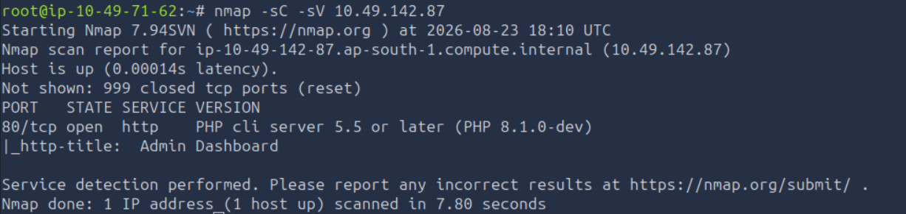
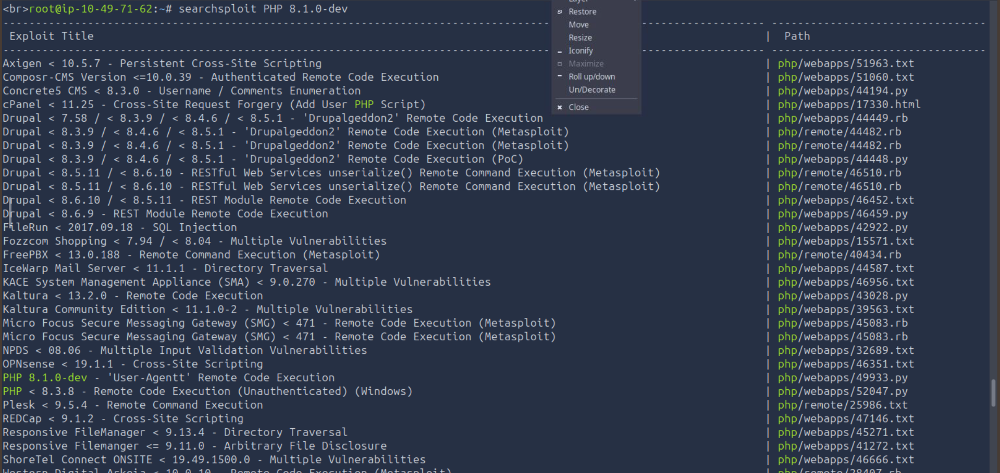
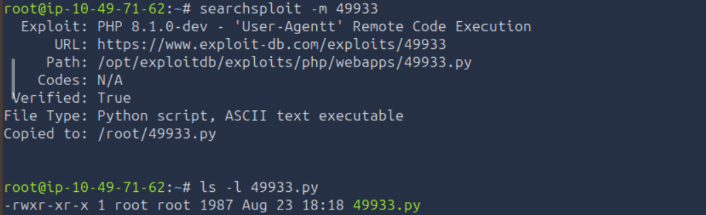
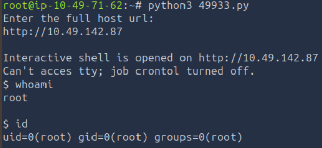
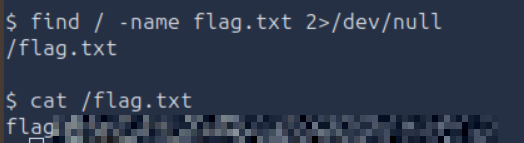

# TryHackMe — Agent T

**Category:** Web Exploitation  
**Difficulty:** Easy  
**Date:** 2026-08-23  

## Goal

Agent T flagged a website that "looked innocent enough," but something was off about how the server responded. The goal is to figure out what's off, get a foothold, and read the flag.

## Solution

Started with a full port scan against the target:

    nmap -sC -sV 10.49.142.87

Only port 80 was open, running `PHP cli server 5.5 or later (PHP 8.1.0-dev)` with a page titled "Admin Dashboard." A dev/pre-release PHP version banner like that is a strong hint on its own — PHP 8.1.0-dev is the exact version tied to a real supply-chain incident. In March 2021, attackers compromised the php-src git server and pushed a malicious commit that added a backdoor triggered by a crafted `User-Agentt` HTTP header (note the extra "t" — a typo-squatted header name), allowing arbitrary PHP code execution through that header's value.

Searched Exploit-DB for anything matching the version banner:

    searchsploit PHP 8.1.0-dev

`PHP 8.1.0-dev - 'User-Agentt' Remote Code Execution` (Exploit-DB 49933) was right there, matching the banner and the backdoor described above exactly. Copied it locally:

    searchsploit -m 49933

Ran the exploit against the target — it opens an interactive shell over HTTP by smuggling PHP payloads through the `User-Agentt` header on each request:

    python3 49933.py
    Enter the full host url: http://10.49.142.87

The shell came back as `root` immediately — the PHP CLI server behind the "Admin Dashboard" page was running with root privileges, so there was no privilege escalation step needed at all. From there it was just a matter of finding and reading the flag:

    find / -name flag.txt 2>/dev/null
    cat /flag.txt

## Result

    flag{[REDACTED]}

## Key Takeaway

A version banner reading "PHP 8.1.0-dev" isn't just an odd-looking dev build — it's a direct fingerprint of a real backdoor planted during a 2021 supply-chain attack on php-src, and Exploit-DB has a ready-made PoC for it. Recognizing a suspicious version string and searching for it by its exact banner text turned a vague "something seems off" hint into root in three commands, with no privilege escalation required at all.
