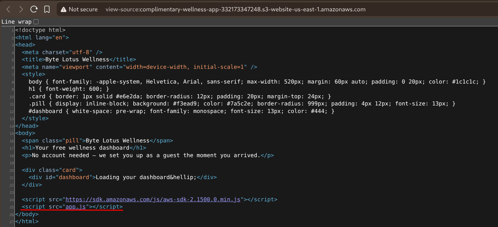
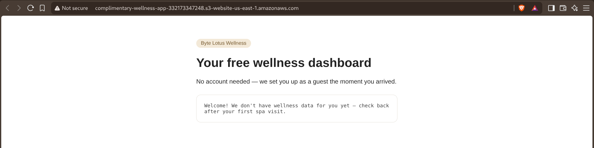
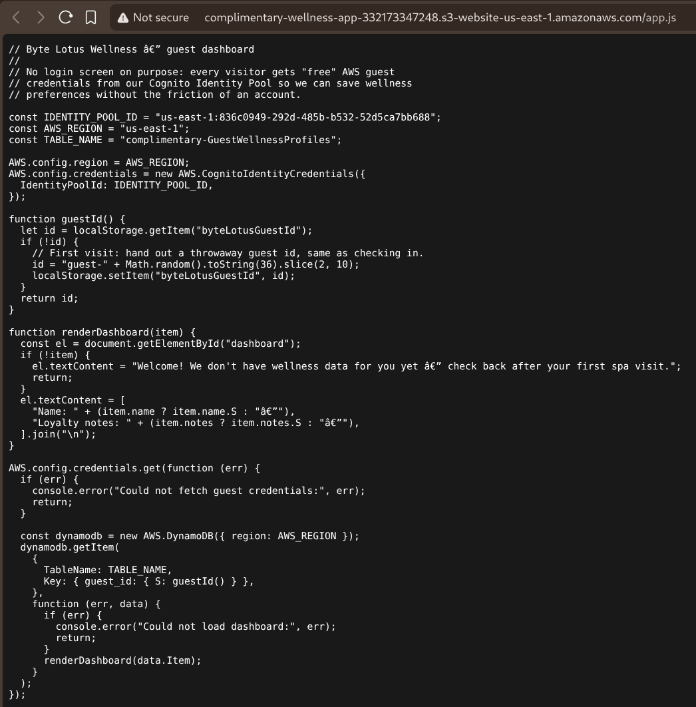
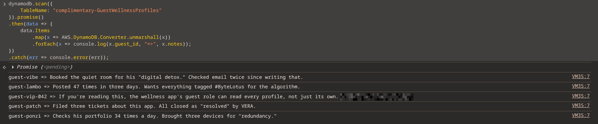
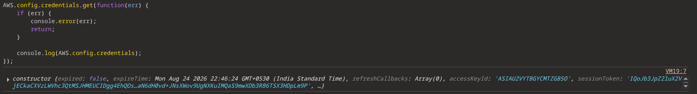

# TryHackMe — Complimentary

**Category:** Cloud Security (AWS)  
**Difficulty:** Easy  
**Date:** 2026-08-24  

## Goal

Byte Lotus's "Complimentary Wellness" app hands every visitor a free AWS guest identity — "no account needed, we set you up as a guest the moment you arrived" — so it can save wellness preferences without login friction. The goal was to figure out what those free guest credentials could actually reach, and recover the flag.

## Solution

Viewing the page source of the S3-hosted static site showed nothing exotic: a plain HTML dashboard loading the AWS SDK from a CDN, plus a local `app.js`.

The rendered page itself was just a placeholder — "Welcome! We don't have wellness data for you yet."

The real logic was in `app.js`. Since it's a static site, that file — and everything in it — ships straight to the browser:

    const IDENTITY_POOL_ID = "us-east-1:836c0949-292d-485b-b532-52d5ca7bb688";
    const AWS_REGION = "us-east-1";
    const TABLE_NAME = "complimentary-GuestWellnessProfiles";

    AWS.config.credentials = new AWS.CognitoIdentityCredentials({
      IdentityPoolId: IDENTITY_POOL_ID,
    });

The app generates a random `guest-XXXXXXXX` ID on first visit, stores it in `localStorage`, gets temporary AWS credentials from the Cognito Identity Pool with no login required, and then calls `dynamodb.getItem()` for just that one guest's record. That's the intended, "safe" flow — one guest, one record.

But nothing stops a visitor from using those same credentials directly from the DevTools console instead of going through the app's code. Rather than `getItem()` for one `guest_id`, calling `scan()` on the whole table:

    dynamodb.scan({ TableName: "complimentary-GuestWellnessProfiles" }).promise()
      .then(data => data.Items
        .map(x => AWS.DynamoDB.Converter.unmarshall(x))
        .forEach(x => console.log(x.guest_id, "=>", x.notes)));

That returned *every* guest's profile in the table, not just the current session's — the IAM policy behind the "guest" role only restricts what the app's code chooses to call, not what the credentials are actually allowed to do. One entry, `guest-vip-042`, spelled the vulnerability out directly: "the wellness app's guest role can read every profile, not just its own," along with the flag.

To confirm this wasn't a client-side bug but a real over-permissioned IAM guest role, checking `AWS.config.credentials` showed genuine short-lived STS credentials (`ASIA...` access key, session token, an hour-out expiry) — the same temporary "unauthenticated guest" role every visitor gets, just used for `scan` instead of `getItem`.

## Result

    flag{[REDACTED]}

## Key Takeaway

An unauthenticated Cognito guest identity that's *supposed* to read only its own record needs that restriction enforced in the IAM policy itself — a condition tying `dynamodb:GetItem` to the caller's own `cognito-identity.amazonaws.com:sub` — not just enforced by which SDK call the front-end code happens to make. The app only ever called `getItem`, but the underlying guest role was permissive enough to `scan` the entire table from a browser console in seconds, which is the actual lesson: client-side code is not an access control boundary.
