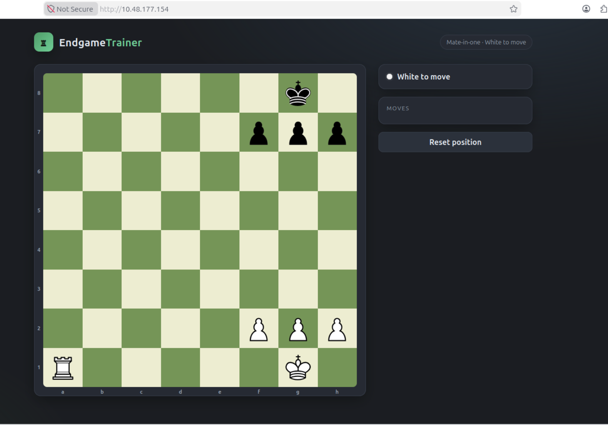
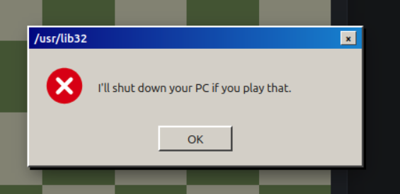
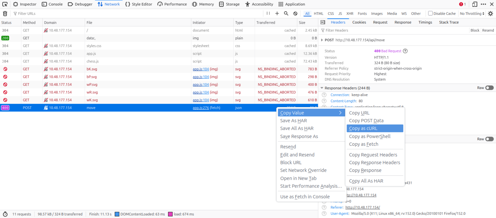
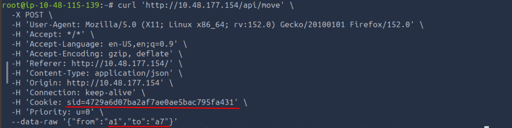
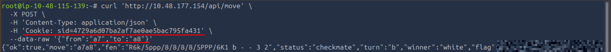

# TryHackMe — Fools Mate

**Category:** TryHackMe / Fools Mate  
**Difficulty:** Easy  
**Date:** 2026-08-17

## Goal

A chess-themed challenge built around an "EndgameTrainer" web app — solve the mate-in-one puzzle it presents and grab the flag.

## Solution

Loaded the app and got a standard mate-in-one position: White to move, rook on a1, king on g1, pawns on f2/g2/h2; Black king on g8 boxed in by its own pawns on f7/g7/h7. The book move is Ra1–a8, a back-rank mate.

Some move attempts through the board's own UI didn't validate anything — they just threw a joke warning dialog instead:

Trying the actual winning move through the UI failed differently — its own POST to `/api/move` came back `400 Bad Request` in the Network tab:

Right-clicked the failed request and copied it as cURL to see exactly what the endpoint expected, including the session cookie. Rebuilt the move by hand from there — first repositioned the rook:

    curl 'http://10.48.177.154/api/move' \
      -X POST \
      -H 'Content-Type: application/json' \
      -H 'Cookie: sid=[REDACTED]' \
      --data-raw '{"from":"a1","to":"a7"}'

Then delivered mate:

    curl 'http://10.48.177.154/api/move' \
      -X POST \
      -H 'Content-Type: application/json' \
      -H 'Cookie: sid=[REDACTED]' \
      --data-raw '{"from":"a7","to":"a8"}'

The response confirmed checkmate and handed back the flag:

## Result

    Flag: [REDACTED]

## Key Takeaway

A puzzle board that posts moves to its own API doesn't need to be solved by clicking pieces — once DevTools shows the endpoint shape and session cookie, replaying the winning move with curl works exactly as well and skips whatever was breaking the UI's own request.
