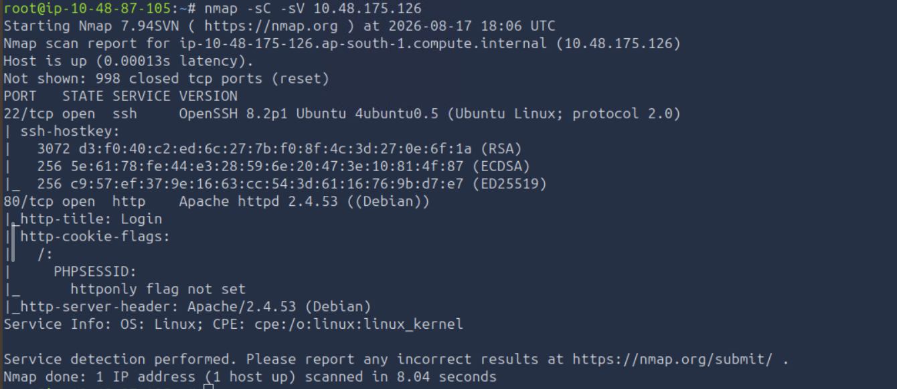
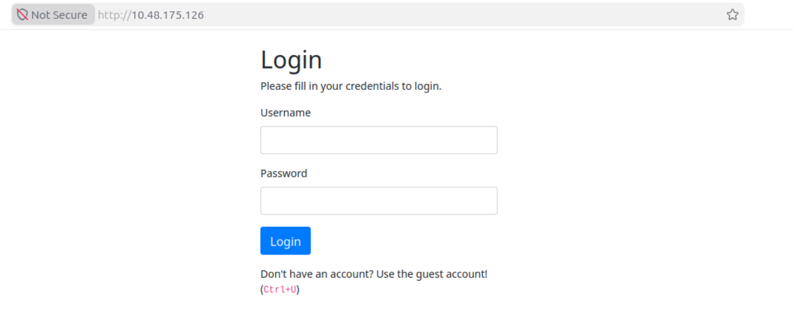
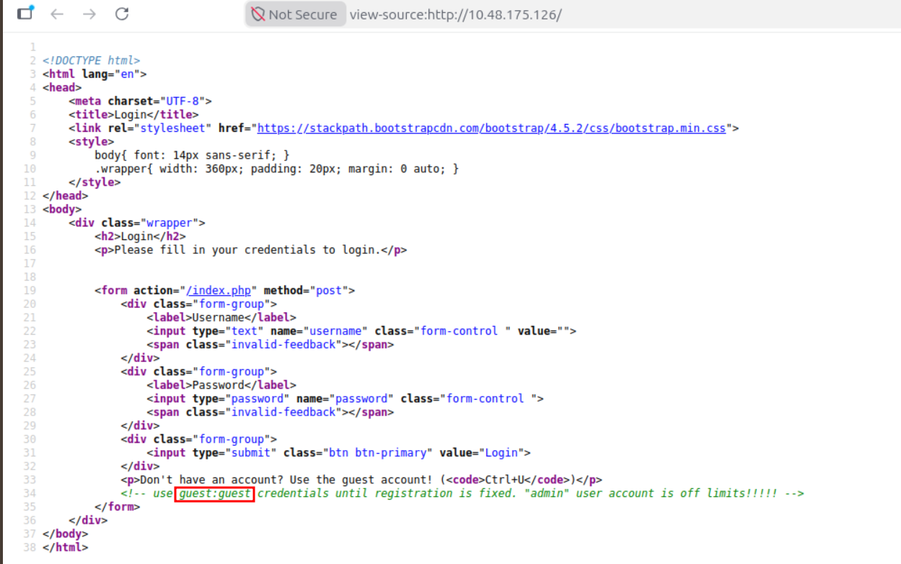
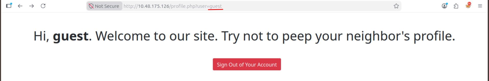
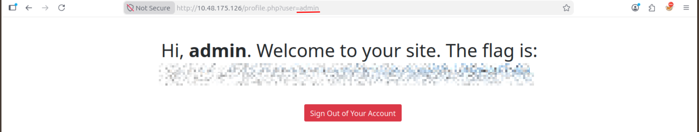

# TryHackMe — Neighbour

**Category:** TryHackMe / Neighbour  
**Difficulty:** Easy  
**Date:** 2026-08-17

## Goal

Cloud auth service challenge — log in and find the flag on the admin's profile without knowing the admin credentials.

## Solution

Quick scan first:

    nmap -sC -sV 10.48.175.126

Port 80 had a login page, no registration open yet:

Viewed the page source and found guest credentials left in an HTML comment, along with a note that the admin account is "off limits":

    view-source:http://10.48.175.126/

Logged in with `guest:guest` and landed on a profile page keyed off a `user` query parameter:

    http://10.48.175.126/profile.php?user=guest

The page copy itself hints at it ("try not to peep your neighbour's profile") — swapped the parameter to `admin`:

    http://10.48.175.126/profile.php?user=admin

## Result

    Flag: [REDACTED]

## Key Takeaway

Access control that's just "whatever `user` is in the URL, show that profile" isn't access control — an IDOR like this needs a server-side check that the logged-in session actually owns the profile being requested, not just a client-visible parameter swap.
