# TryHackMe — Pickle Rick

**Category:** TryHackMe / Pickle Rick  
**Difficulty:** Easy  
**Date:** 2026-08-16

## Goal

Rick and Morty themed challenge — find the three secret ingredients for Rick's pickle-reverse potion.

## Solution

Quick scan first:

    nmap -sC -sV 10.49.156.155

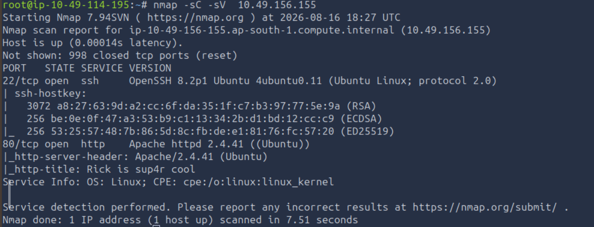

Port 80 was running the "Rick is sup4r cool" site. Viewed the page source and found a username left in an HTML comment:

    view-source:http://10.49.156.155/

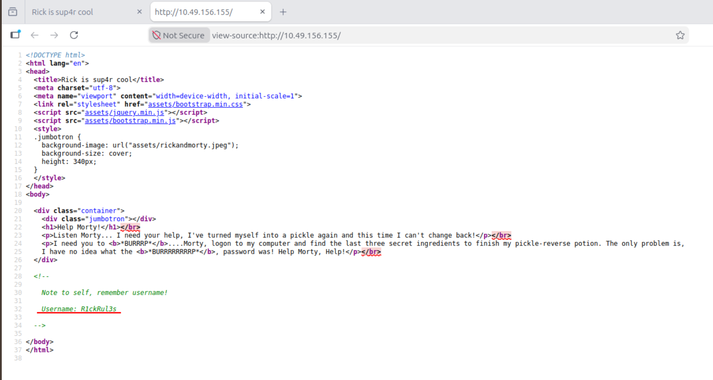

Checked `robots.txt` next, which had a password-shaped string sitting in it:

    http://10.49.156.155/robots.txt

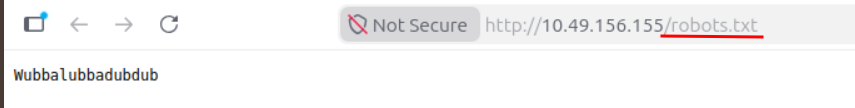

Used the username from the source (`R1ckRul3s`) and the string from `robots.txt` as the password on the login page, which dropped into a portal:

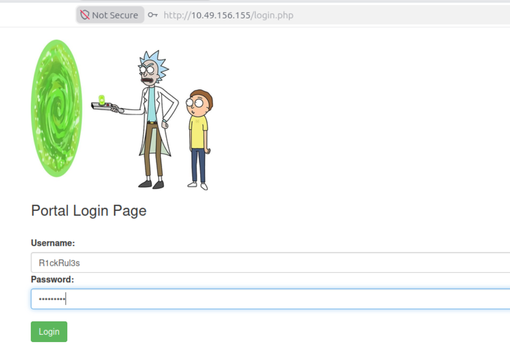

The portal has a command panel that runs arbitrary shell commands as `www-data`. Listed the current directory:

    ls

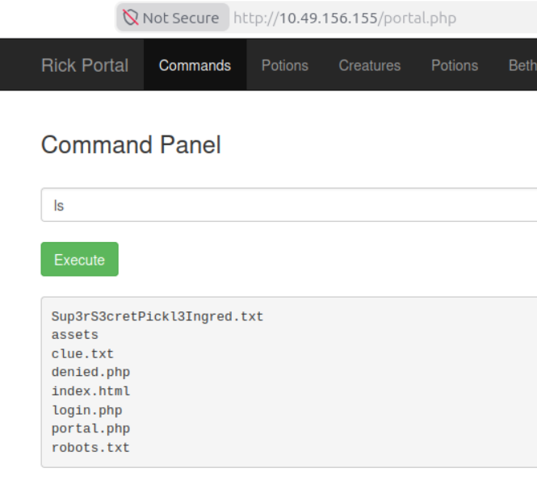

`cat` was blocked on the ingredient file (`more` and `head` were blocked too):

    cat Sup3rS3cretPickl3Ingred.txt

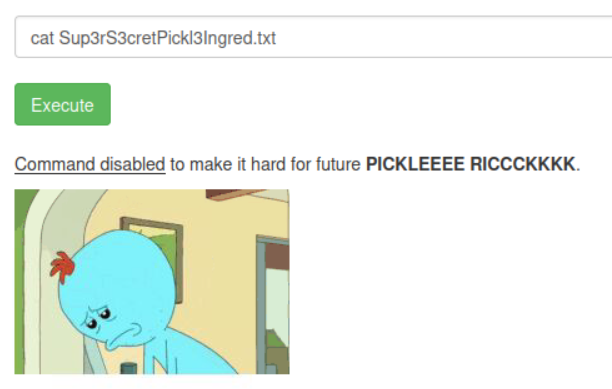

`less` wasn't blocked, so used that instead for the first ingredient:

    less Sup3rS3cretPickl3Ingred.txt

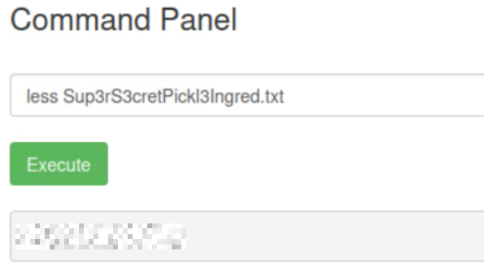

Checked Rick's home directory for the second one:

    ls /home/rick

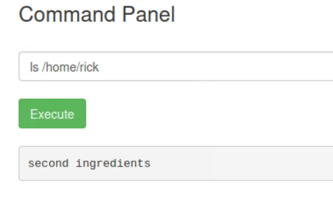

    less "/home/rick/second ingredients"

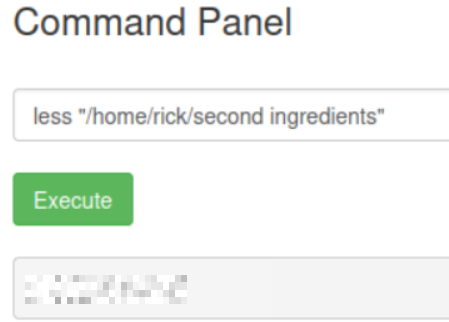

For the third, checked sudo permissions:

    sudo -l

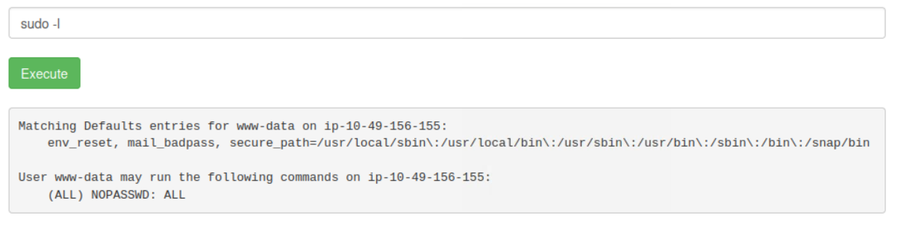

`www-data` can run anything as root with no password, so listed `/root` directly:

    sudo ls -la /root

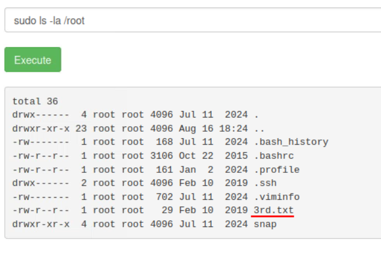

    sudo less /root/3rd.txt

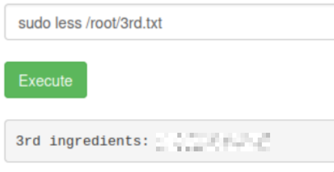

## Result

    1st ingredient: [REDACTED]
    2nd ingredient: [REDACTED]
    3rd ingredient: [REDACTED]

## Key Takeaway

When a box blocks the obvious file-reading commands (`cat`, `more`, `head`), it's not blocking file reading in general — `less` isn't on most people's radar to block and worked immediately.
