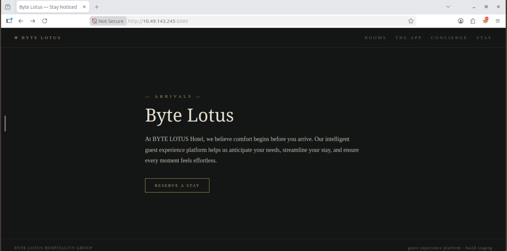
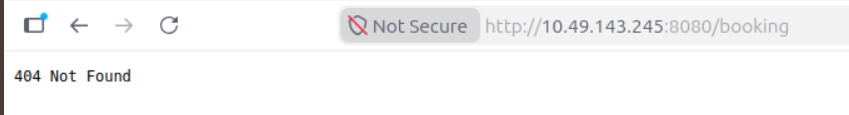
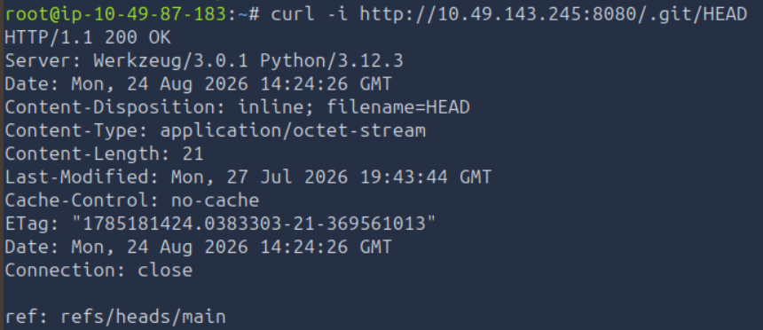
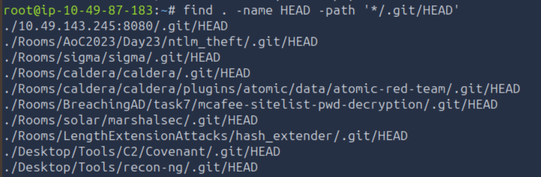
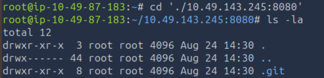
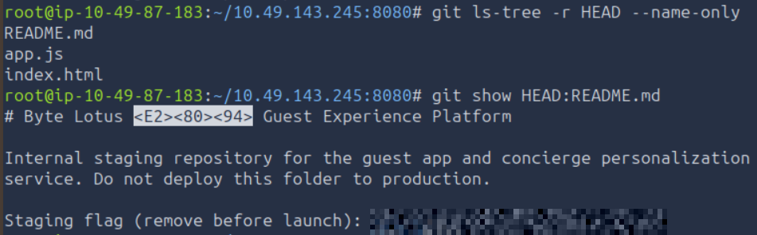

# TryHackMe — Room 404

**Category:** Web Exploitation / Recon  
**Difficulty:** Easy  
**Date:** 2026-08-24  

## Goal

Byte Lotus is a hotel "guest experience platform" whose staging build was reachable directly on the network. The goal was to find whatever the developers left exposed on that staging server and recover the flag.

## Solution

The site itself ("Byte Lotus — Stay Noticed") was just a marketing landing page — rooms, the app, concierge, stay — nothing obviously vulnerable on the surface.

Poking at obvious paths came up empty at first. `/booking` 404'd:

And so did `/robots.txt`:

    curl http://10.49.143.245:8080/robots.txt

The interesting one was `/.git/HEAD` — a path developers often forget to block when a `.git` folder gets pushed to a staging server along with the rest of the app:

    curl -i http://10.49.143.245:8080/.git/HEAD

That came back `200 OK` with a real git ref (`ref: refs/heads/main`), confirming the whole `.git` directory — history, objects, everything — was being served by the app's static file handler (Werkzeug/Flask dev server). That's enough to reconstruct the entire repository without ever touching a proper git smart-HTTP endpoint.

    cd './10.49.143.245:8080'
    ls -la

With the `.git` folder pulled down locally, the tracked files could be listed and read straight out of the repo's history — no more guessing routes on the live server:

    git ls-tree -r HEAD --name-only
    git show HEAD:README.md

`README.md` turned out to be an internal note that was never meant to ship: a warning that this was a staging repo not meant for production, followed by a "staging flag (remove before launch)" line — exactly the kind of leftover secret an exposed `.git` folder hands over for free.

## Result

    flag{[REDACTED]}

## Key Takeaway

A 404 on every guessed route doesn't mean there's nothing there — `/.git/HEAD` returning `200 OK` on a Flask/Werkzeug static server was the real finding, because it meant the entire version-control history, including files never linked from the live site, was sitting in the open. Once a `.git` directory is reachable, the fastest path in is treating it as an ordinary git repo rather than continuing to brute-force URLs.
