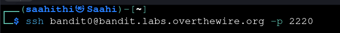
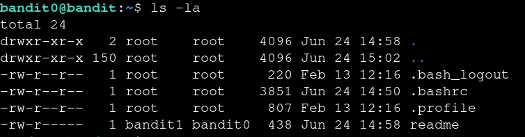
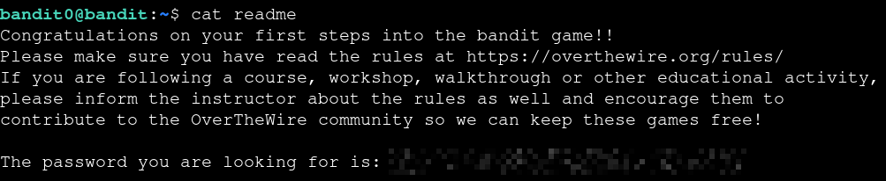

# Bandit — Level 0 → 1

**Category:** OverTheWire / Bandit
**Difficulty:** Easy
**Date:** 2026-08-09

## Goal

Log into Bandit via SSH as `bandit0` (password: `bandit0`) and find the password for `bandit1`.

    ssh bandit0@bandit.labs.overthewire.org -p 2220

## Solution

Listed the home directory and found a `readme` file:

    $ ls -la
    -rw-r----- 1 bandit1 bandit0 438 Jun 24 14:58 readme

Read it directly with `cat`:

    $ cat readme
    [REDACTED]

## Result

    Password for bandit1: [REDACTED]

## Key Takeaway

Basic Bandit workflow: enumerate the home directory, find the readable file holding the next password, `cat` it.
