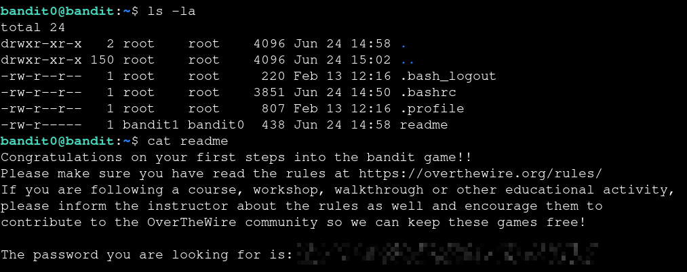

# Bandit — Level 0 → 1

**Category:** OverTheWire / Bandit  
**Difficulty:** Easy  
**Date:** 2026-08-09

## Goal

The objective was to log into the Bandit server using SSH and find the password for `bandit1`.

The connection details provided were:

    ssh bandit0@bandit.labs.overthewire.org -p 2220

The username was `bandit0`, and the initial password was also `bandit0`.

## Recon

After logging into the server, I listed the contents of the home directory:

    $ ls -la

The directory contained a file named `readme`:

    -rw-r----- 1 bandit0 bandit0 33 Jun 24 14:58 readme

Since the level goal stated that the next password was stored in `readme`, I needed to read its contents.

## Approach

The file was located in the current directory, so there was no need to change directories. I used `cat` to display its contents.

## Exploitation / Solution

    $ cat readme
    [REDACTED]

The returned value was the password for `bandit1`.

I then used it to connect to the next level:

    $ ssh bandit1@bandit.labs.overthewire.org -p 2220

The login was successful, confirming that the password was correct.

## Result

    Password for bandit1: [REDACTED]

The shell changed to:

    bandit1@bandit:~$

## Key Takeaway

This level introduced the basic workflow of the Bandit wargame: enumerate the current environment, identify the relevant file, read its contents, and use the discovered credential to move to the next level.
