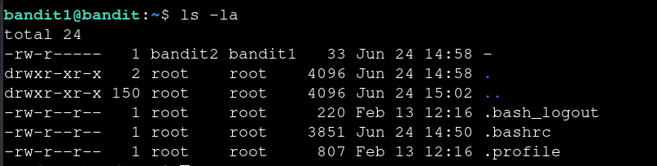
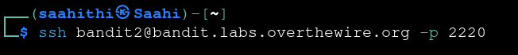

# Bandit — Level 1 → 2

**Category:** OverTheWire / Bandit  
**Difficulty:** Easy  
**Date:** 2026-08-10  
**Level page:** [bandit1.html](https://overthewire.org/wargames/bandit/bandit1.html)

## Goal

The password for `bandit2` was stored in a file literally named `-` in the home directory.

## Solution

Listed the home directory and found the file:

    $ ls -la
    -rw-r----- 1 bandit2 bandit1 33 Jun 24 14:58 -

`-` is normally interpreted by Unix commands as standard input, so `cat -` wouldn't read the file. Prefixing it with `./` forces it to be treated as a filename in the current directory:

    $ cat ./-
    [REDACTED]

Used the password to connect to the next level:

    $ ssh bandit2@bandit.labs.overthewire.org -p 2220

## Result

    Password for bandit2: [REDACTED]

## Key Takeaway

A filename starting with `-` can be misread as a command option or stdin. Prefix it with `./` to make clear it's a file in the current directory.
