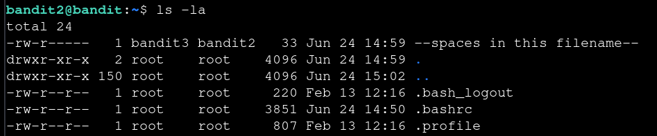

# Bandit — Level 2 → 3

**Category:** OverTheWire / Bandit  
**Difficulty:** Easy  
**Date:** 2026-08-10

## Goal

The password for `bandit3` was stored in a file whose name contained spaces, in the home directory of `bandit2`.

    ssh bandit2@bandit.labs.overthewire.org -p 2220

## Solution

Listed the home directory and found the file:

    $ ls -la
    -rw-r----- 1 bandit3 bandit2 33 Jun 24 14:59 --spaces in this filename--

The filename starts with `--` and contains spaces, so it needs to be quoted (and prefixed with `./` so it isn't read as a command flag):

    $ cat "./--spaces in this filename--"
    [REDACTED]

## Result

    Password for bandit3: [REDACTED]

## Key Takeaway

Filenames with spaces or leading dashes need to be quoted and/or prefixed with `./` so the shell treats them as a literal path rather than splitting on whitespace or parsing them as flags.
