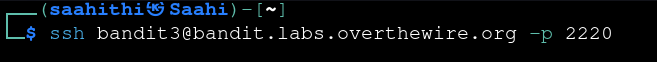
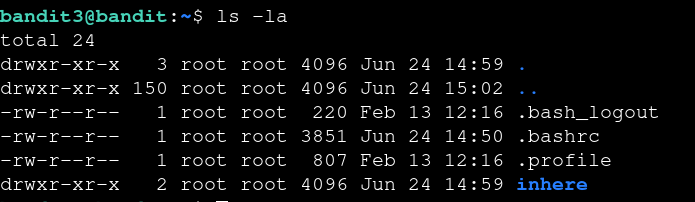
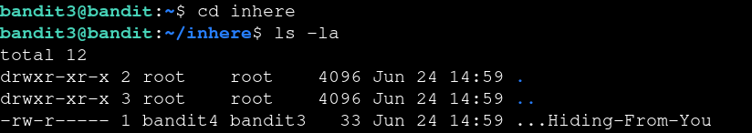

# Bandit — Level 3 → 4

**Category:** OverTheWire / Bandit  
**Difficulty:** Easy  
**Date:** 2026-08-10

## Goal

The password for `bandit4` was stored in a hidden file inside a directory called `inhere`.

    ssh bandit3@bandit.labs.overthewire.org -p 2220

## Solution

Listed the home directory and found `inhere`:

    $ ls -la
    drwxr-xr-x 2 root root 4096 Jun 24 14:59 inhere

`ls -la` by default only shows hidden files (dotfiles) when you pass `-a`, so going into `inhere` and listing again with `-la` was necessary to spot the hidden file:

    $ cd inhere
    $ ls -la
    -rw-r----- 1 bandit4 bandit3 33 Jun 24 14:59 ...Hiding-From-You

Read it with `cat`:

    $ cat ...Hiding-From-You
    [REDACTED]

## Result

    Password for bandit4: [REDACTED]

## Key Takeaway

The password wasn't in the home directory — it required `cd`-ing into `inhere` first, then running `ls -la` again to reveal the hidden dotfile `...Hiding-From-You`. Hidden files won't show without `-a`, and subdirectories need to be entered and listed on their own.
