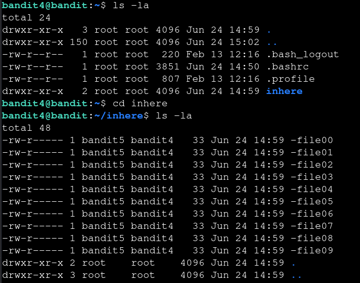
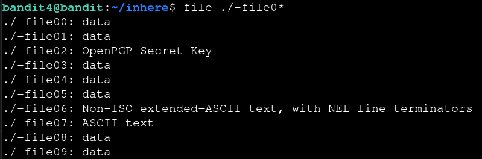

# Bandit — Level 4 → 5

**Category:** OverTheWire / Bandit  
**Difficulty:** Easy  
**Date:** 2026-08-10  
**Level page:** [bandit4.html](https://overthewire.org/wargames/bandit/bandit4.html)

## Goal

The password for `bandit5` was in the only human-readable file among ten files in `inhere`.

    ssh bandit4@bandit.labs.overthewire.org -p 2220

## Solution

Went into `inhere` and found ten files, `-file00` through `-file09`:

    $ cd inhere
    $ ls -la
    -rw-r----- 1 bandit5 bandit4 33 Jun 24 14:59 -file00
    ...
    -rw-r----- 1 bandit5 bandit4 33 Jun 24 14:59 -file09

`cat`-ing each one blind wouldn't tell me which held the password, so I used `file` to check the type of every file at once (the `./` prefix again avoids the leading `-` being read as a flag):

    $ file ./-file0*
    ./-file00: data
    ./-file01: data
    ./-file02: OpenPGP Secret Key
    ./-file03: data
    ./-file04: data
    ./-file05: data
    ./-file06: Non-ISO extended-ASCII text, with NEL line terminators
    ./-file07: ASCII text
    ./-file08: data
    ./-file09: data

`-file07` was the only one flagged as plain `ASCII text`, so that was the readable one:

    $ cat ./-file07
    [REDACTED]

## Result

    Password for bandit5: [REDACTED]

## Key Takeaway

When a directory is full of similarly-named files and it's not clear which one matters, `file` on all of them at once is faster than `cat`-ing each blindly — it flags the one that's actual `ASCII text` versus binary data or other formats.
