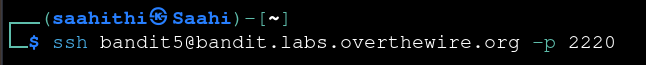
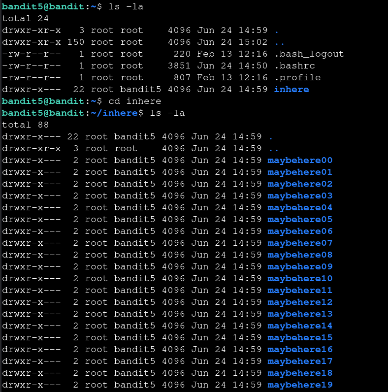
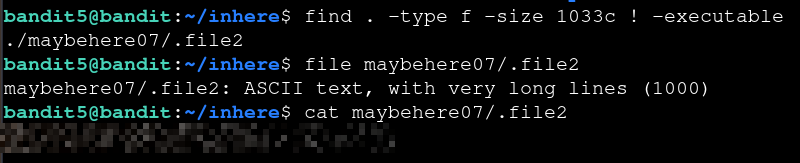

# Bandit — Level 5 → 6

**Category:** OverTheWire / Bandit  
**Difficulty:** Easy  
**Date:** 2026-08-10

## Goal

The password for `bandit6` was in a file inside `inhere`, described as: human-readable, 1033 bytes, and not executable.

    ssh bandit5@bandit.labs.overthewire.org -p 2220

## Solution

`inhere` contained 20 subdirectories (`maybehere00` through `maybehere19`), each presumably full of decoy files, so browsing manually wasn't practical:

    $ cd inhere
    $ ls -la
    drwxr-x--- 2 root root 4096 Jun 24 14:59 maybehere00
    ...
    drwxr-x--- 2 root root 4096 Jun 24 14:59 maybehere19

Used `find` with the exact criteria given in the level goal — a regular file, exactly 1033 bytes, not executable — to search all the subdirectories at once:

    $ find . -type f -size 1033c ! -executable
    ./maybehere07/.file2

Confirmed the type with `file`, then read it:

    $ file maybehere07/.file2
    maybehere07/.file2: ASCII text, with very long lines (1000)
    $ cat maybehere07/.file2
    [REDACTED]

## Result

    Password for bandit6: [REDACTED]

## Key Takeaway

When a level gives exact file properties (size, permissions, type) instead of a name, `find` with the matching flags (`-size`, `! -executable`, `-type f`) searches every subdirectory at once instead of checking each one by hand.
