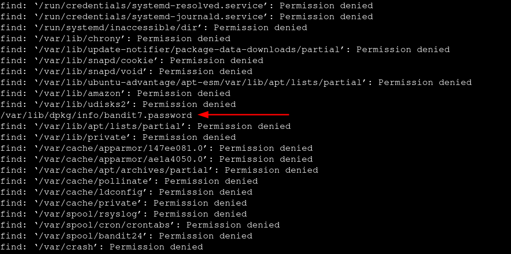

# Bandit — Level 6 → 7

**Category:** OverTheWire / Bandit  
**Difficulty:** Easy  
**Date:** 2026-08-11

## Goal

The password for `bandit7` was in a file somewhere on the entire filesystem, owned by user `bandit7`, group `bandit6`, and exactly 33 bytes.

    ssh bandit6@bandit.labs.overthewire.org -p 2220

## Solution

The file wasn't in the home directory this time, so I searched from `/` using the ownership and size the level gave me:

    $ find / -type f -user bandit7 -group bandit6 -size 33c

Most of the output was `Permission denied` noise from directories bandit6 couldn't read:

Buried in the rest of the denied errors was the one real match:

    /var/lib/dpkg/info/bandit7.password

Read it with `cat`:

    $ cat /var/lib/dpkg/info/bandit7.password
    [REDACTED]

## Result

    Password for bandit7: [REDACTED]

## Key Takeaway

A system-wide `find` from `/` will throw a wall of `Permission denied` errors for directories you can't read — that's expected and not a failure. The real match sits mixed in with the noise, so scan the full output (or filter stderr with `2>/dev/null`) rather than assuming the search failed.
