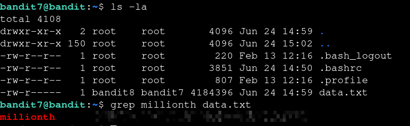

# Bandit — Level 7 → 8

**Category:** OverTheWire / Bandit  
**Difficulty:** Easy  
**Date:** 2026-08-11

## Goal

The password for `bandit8` was in `data.txt`, on the line next to the word `millionth`.

    ssh bandit7@bandit.labs.overthewire.org -p 2220

## Solution

`data.txt` was over 4MB, so opening it directly wasn't practical. Used `grep` to pull out just the line containing `millionth`:

    $ ls -la
    -rw-r----- 1 bandit8 bandit7 4184396 Jun 24 14:59 data.txt
    $ grep millionth data.txt
    millionth [REDACTED]

## Result

    Password for bandit8: [REDACTED]

## Key Takeaway

No way I was scrolling a 4MB file for one line — `grep millionth data.txt` found it instantly.
