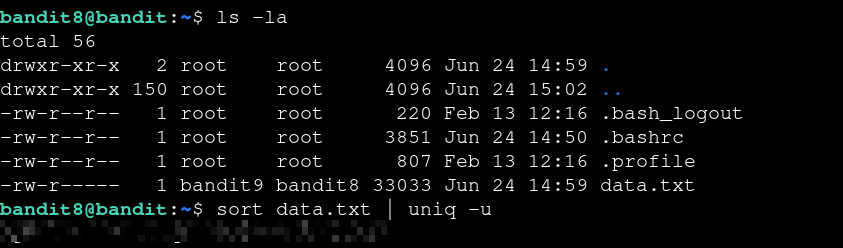

# Bandit — Level 8 → 9

**Category:** OverTheWire / Bandit  
**Difficulty:** Easy  
**Date:** 2026-08-11  
**Level page:** [bandit8.html](https://overthewire.org/wargames/bandit/bandit8.html)

## Goal

The password for `bandit9` was the one line in `data.txt` that occurs only once — every other line is duplicated.

    ssh bandit8@bandit.labs.overthewire.org -p 2220

## Solution

`uniq -u` only prints lines with no duplicates, but it requires matching lines to be adjacent, so the file needs to be sorted first:

    $ ls -la
    -rw-r----- 1 bandit9 bandit8 33033 Jun 24 14:59 data.txt
    $ sort data.txt | uniq -u
    [REDACTED]

## Result

    Password for bandit9: [REDACTED]

## Key Takeaway

`uniq -u` only catches duplicates that are next to each other, so piping through `sort` first is required to group identical lines before filtering out the one that appears just once.
