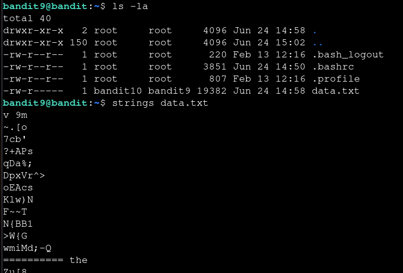
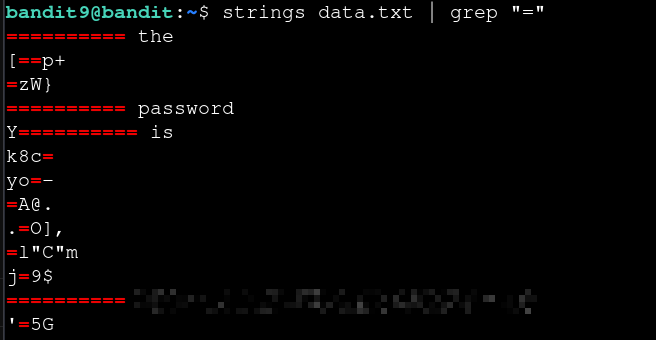

# Bandit — Level 9 → 10

**Category:** OverTheWire / Bandit  
**Difficulty:** Easy  
**Date:** 2026-08-11  
**Level page:** [bandit9.html](https://overthewire.org/wargames/bandit/bandit9.html)

## Goal

The password for `bandit10` was in `data.txt`, which contained mostly binary data, and was preceded by several `=` characters.

    ssh bandit9@bandit.labs.overthewire.org -p 2220

## Solution

`data.txt` was full of non-printable binary bytes, so `cat` would be unreadable. Used `strings` to pull out just the printable text:

    $ ls -la
    -rw-r----- 1 bandit10 bandit9 19382 Jun 24 14:58 data.txt
    $ strings data.txt

This still returned a lot of unrelated printable fragments. Since the level hint said the password was preceded by several `=` characters, piped the output through `grep "="` to narrow it down to the matching line:

    $ strings data.txt | grep "="
    ========== password
    [REDACTED]

## Result

    Password for bandit10: [REDACTED]

## Key Takeaway

`strings` extracts printable text from binary files that `cat` can't display cleanly. When the output is still noisy, chaining it into `grep` with a pattern from the level's hint (here, the `=` characters) filters it down to the relevant line.
