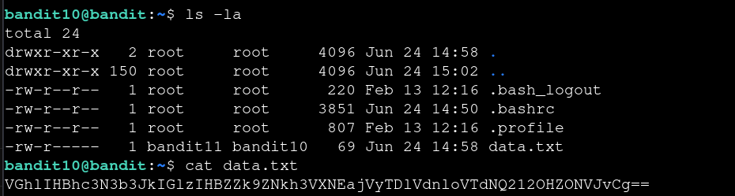

# Bandit — Level 10 → 11

**Category:** OverTheWire / Bandit  
**Difficulty:** Easy  
**Date:** 2026-08-11  
**Level page:** [bandit10.html](https://overthewire.org/wargames/bandit/bandit10.html)

## Goal

The password for `bandit11` was in `data.txt`, base64-encoded.

    ssh bandit10@bandit.labs.overthewire.org -p 2220

## Solution

Reading the file showed a base64 string (recognizable from the character set and trailing `==` padding):

    $ ls -la
    -rw-r----- 1 bandit11 bandit10 69 Jun 24 14:58 data.txt
    $ cat data.txt
    VGhlIHBhc3N3b3JkIGlzIHBZk9ZNkh3VXNEajVyTDlVdnloVTdNQ212OHZONVJvCg==

Decoded it with `base64 --decode`:

    $ base64 --decode data.txt
    The password is [REDACTED]

## Result

    Password for bandit11: [REDACTED]

## Key Takeaway

Base64 is recognizable by its alphanumeric-plus-`+/` character set and `=` padding at the end. `base64 --decode` reverses it directly — no need for anything more complex.
