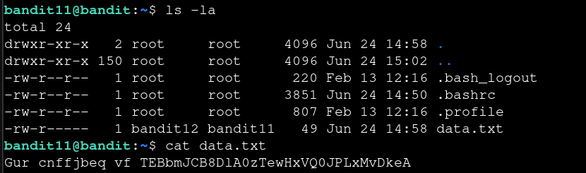

# Bandit — Level 11 → 12

**Category:** OverTheWire / Bandit  
**Difficulty:** Easy  
**Date:** 2026-08-11

## Goal

The password for `bandit12` was in `data.txt`, encoded with ROT13 (each letter rotated 13 places).

    ssh bandit11@bandit.labs.overthewire.org -p 2220

## Solution

The file contents were readable text but scrambled in a way consistent with a Caesar-style letter shift:

    $ cat data.txt
    Gur cnffjbeq vf TEBbmJCB8D1A0zTewHxVQ0JPLxMvDkeA

Used `tr` to map each letter 13 places forward (uppercase and lowercase separately), which both encodes and decodes ROT13 since it's a fixed 13-letter rotation on a 26-letter alphabet:

    $ tr 'A-Za-z' 'N-ZA-Mn-za-m' < data.txt
    The password is [REDACTED]

## Result

    Password for bandit12: [REDACTED]

## Key Takeaway

ROT13 is self-inverse — applying the same 13-letter shift again undoes it. `tr 'A-Za-z' 'N-ZA-Mn-za-m'` handles both encoding and decoding in one command, no separate decode step needed.
