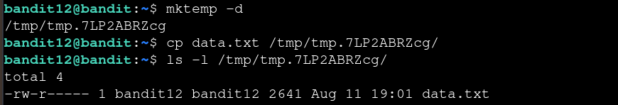
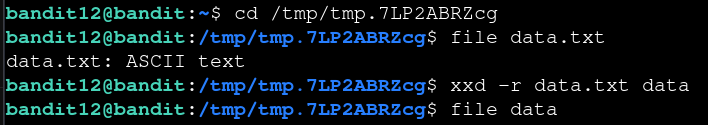
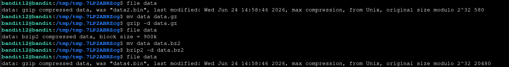
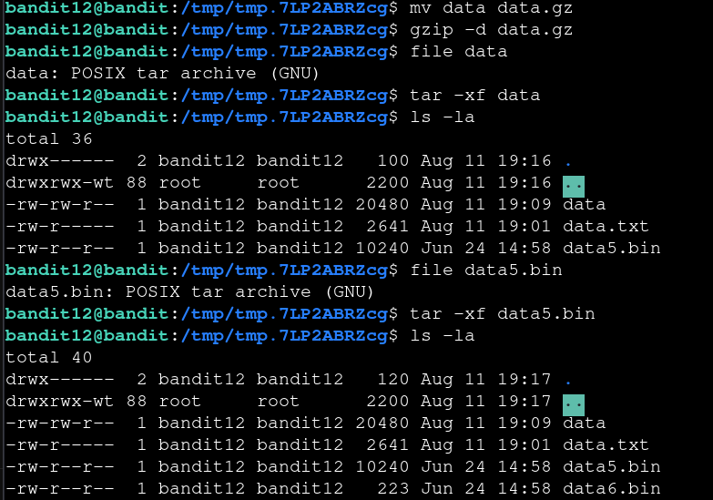
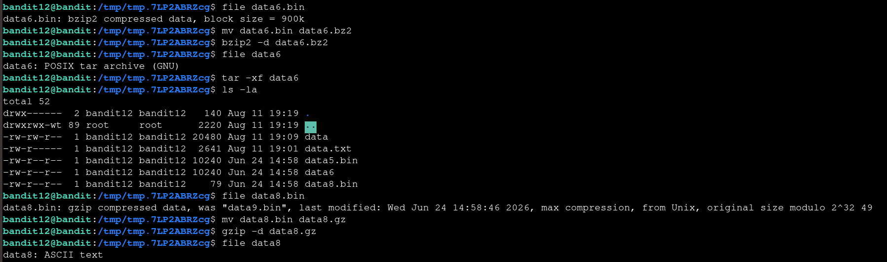

# Bandit — Level 12 → 13

**Category:** OverTheWire / Bandit  
**Difficulty:** Medium  
**Date:** 2026-08-12

## Goal

The password for `bandit13` was hidden inside `data.txt`, described as a hexdump of a file that had been compressed multiple times over.

    ssh bandit12@bandit.labs.overthewire.org -p 2220

## Solution

`data.txt` is only readable by `bandit12`, and this level involves a lot of file juggling, so I worked in a scratch directory instead of the home folder:

    $ mkdir /tmp/tmp.7LP2ABRZcg   # via mktemp -d
    $ cp data.txt /tmp/tmp.7LP2ABRZcg/
    $ cd /tmp/tmp.7LP2ABRZcg

`file` confirmed `data.txt` was plain ASCII (a hexdump), so `xxd -r` reversed it back into the original binary:

    $ file data.txt
    data.txt: ASCII text
    $ xxd -r data.txt data

From there it was a repeated cycle of running `file` to identify the compression format, renaming to the matching extension, and decompressing — each layer revealing another compressed file underneath:

    $ file data
    data: gzip compressed data, was "data2.bin" ...
    $ mv data data.gz && gzip -d data.gz
    $ file data
    data: bzip2 compressed data, block size = 900k
    $ mv data data.bz2 && bzip2 -d data.bz2
    $ file data
    data: gzip compressed data, was "data4.bin" ...

    $ mv data data.gz && gzip -d data.gz
    $ file data
    data: POSIX tar archive (GNU)
    $ tar -xf data
    $ file data5.bin
    data5.bin: POSIX tar archive (GNU)
    $ tar -xf data5.bin

Two of the layers turned out to be `tar` archives rather than compressed streams, so those needed `tar -xf` instead of a decompressor:

    $ file data6.bin
    data6.bin: bzip2 compressed data, block size = 900k
    $ mv data6.bin data6.bz2 && bzip2 -d data6.bz2
    $ file data6
    data6: POSIX tar archive (GNU)
    $ tar -xf data6
    $ file data8.bin
    data8.bin: gzip compressed data, was "data9.bin" ...
    $ mv data8.bin data8.gz && gzip -d data8.gz
    $ file data8
    data8: ASCII text

The last layer was bzip2, then another tar archive, then a final gzip layer that finally unpacked into plain ASCII text:

    $ cat data8
    The password is [REDACTED]

## Result

    Password for bandit13: [REDACTED]

## Key Takeaway

Nested/compressed files don't announce their format from the filename — `file` has to be run after every step to see what's underneath, since gzip, bzip2, and tar can be layered in any order and combination. Working in a scratch directory (`mktemp -d`) kept the growing pile of intermediate files out of the home directory.
