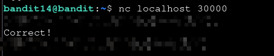

# Bandit — Level 14 → 15

**Category:** OverTheWire / Bandit  
**Difficulty:** Easy  
**Date:** 2026-08-12

## Goal

The password for `bandit15` was returned by submitting `bandit14`'s password to a service listening on `localhost:30000`.

## Solution

Connected to the local port with `nc` and sent the current password:

    $ nc localhost 30000
    [bandit14's password]
    Correct!
    [REDACTED]

## Result

    Password for bandit15: [REDACTED]

## Key Takeaway

`nc host port` opens a raw connection to a listening service — typing input and hitting enter sends it directly, useful for talking to custom TCP services that aren't SSH or HTTP.
