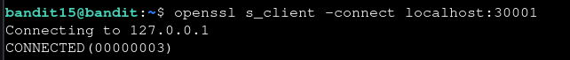

# Bandit — Level 15 → 16

**Category:** OverTheWire / Bandit  
**Difficulty:** Medium  
**Date:** 2026-08-12

## Goal

The password for `bandit16` was returned by submitting `bandit15`'s password to an SSL/TLS-encrypted service on `localhost:30001`.

    ssh bandit15@bandit.labs.overthewire.org -p 2220

## Solution

Port 30001 uses SSL, so a plain `nc` connection wouldn't complete the handshake. Used `openssl s_client` instead, which negotiates TLS before handing over the connection:

    $ openssl s_client -connect localhost:30001
    Connecting to 127.0.0.1
    CONNECTED(00000003)

After the certificate/handshake output, submitted `bandit15`'s password:

    [bandit15's password]
    Correct!
    [REDACTED]
    closed

## Result

    Password for bandit16: [REDACTED]

## Key Takeaway

When a service is SSL/TLS-wrapped, plain `nc` can't complete the connection — `openssl s_client -connect host:port` handles the TLS handshake and then lets you interact with the service the same way `nc` would.
