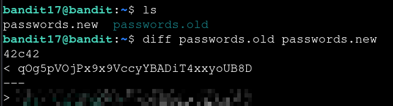

# Bandit — Level 17 → 18

**Category:** OverTheWire / Bandit  
**Difficulty:** Easy  
**Date:** 2026-08-12

## Goal

`bandit18`'s home directory held `passwords.old` and `passwords.new`. The password for `bandit18` was the one line that changed between the two files.

## Solution

    $ ls
    passwords.new  passwords.old

Ran `diff` to compare the two files directly rather than scanning both by eye:

    $ diff passwords.old passwords.new
    42c42
    < qOg5pVOjPx9x9VccyYBADiT4xxyoUB8D
    ---
    > [REDACTED]

`diff` flagged line 42 as changed (`42c42`), showing the old value on the left (`<`) and the new one on the right (`>`) — the new value was the password for `bandit18`.

## Result

    Password for bandit18: [REDACTED]

## Key Takeaway

`diff file1 file2` pinpoints exactly which lines differ between two similar files instead of comparing them manually — the `<`/`>` markers show the old and new versions side by side.
