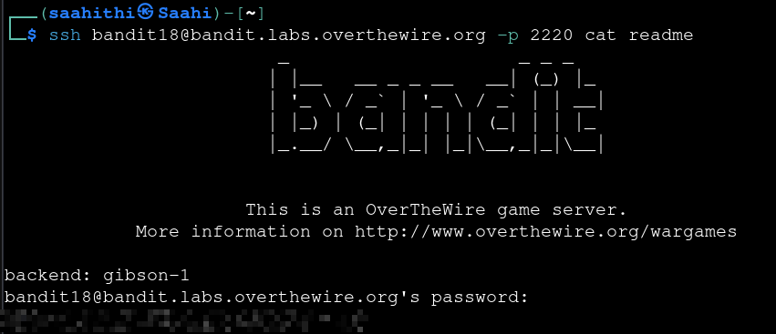
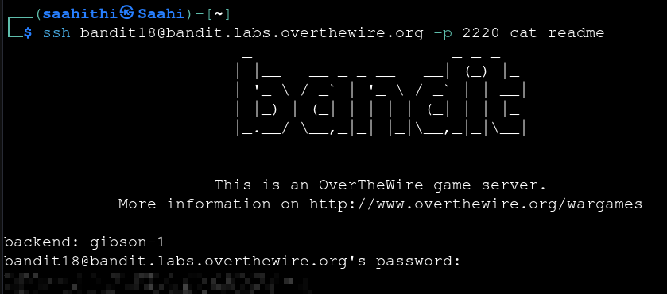

# Bandit — Level 18 → 19

**Category:** OverTheWire / Bandit  
**Difficulty:** Medium  
**Date:** 2026-08-13  
**Level page:** [bandit18.html](https://overthewire.org/wargames/bandit/bandit18.html)

## Goal

The password for `bandit19` was in `readme` in `bandit18`'s home directory. Someone had modified `.bashrc` to log the user out immediately on SSH login.

    ssh bandit18@bandit.labs.overthewire.org -p 2220

A normal interactive login connected and then immediately disconnected:

    Enjoy your stay!
    Byebye !
    Connection to bandit.labs.overthewire.org closed.

## Solution

`.bashrc` only fires on interactive shells, so I tacked the command straight onto the `ssh` call — that skips `.bashrc` (and the logout) entirely:

    $ ssh bandit18@bandit.labs.overthewire.org -p 2220 cat readme

After entering `bandit18`'s password at the prompt, the command's output — the contents of `readme` — came back instead of a shell:

    bandit18@bandit.labs.overthewire.org's password:
    [REDACTED]

## Result

    Password for bandit19: [REDACTED]

## Key Takeaway

`.bashrc` (and similar shell startup files) only fire for interactive sessions. Passing a command as an argument to `ssh` runs it non-interactively on the remote end and returns its output directly, bypassing any startup script — including one deliberately set up to log you out.
