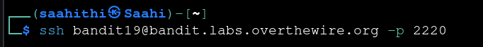
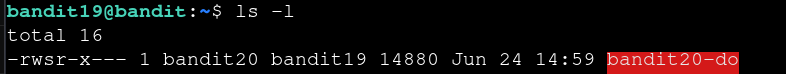
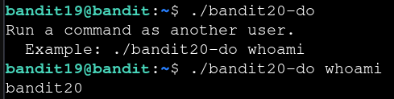

# Bandit — Level 19 → 20

**Category:** OverTheWire / Bandit  
**Difficulty:** Medium  
**Date:** 2026-08-13

## Goal

The password for `bandit20` was in `/etc/bandit_pass/bandit20`, readable only by `bandit20`. `bandit19`'s home directory held a SUID binary that runs a given command as `bandit20`.

    ssh bandit19@bandit.labs.overthewire.org -p 2220

## Solution

Listed the home directory and found `bandit20-do`, owned by `bandit20` with the setuid bit set (`rwsr-x---` — the `s` in place of the owner's execute bit):

    $ ls -l
    -rwsr-x--- 1 bandit20 bandit19 14880 Jun 24 14:59 bandit20-do

Since it's SUID it should run as `bandit20` no matter who calls it — checked with `whoami`:

    $ ./bandit20-do whoami
    bandit20

Used it to read the password file directly, since `bandit19` alone couldn't:

    $ ./bandit20-do cat /etc/bandit_pass/bandit20
    [REDACTED]

## Result

    Password for bandit20: [REDACTED]

## Key Takeaway

A SUID binary runs with its owner's privileges, not the caller's — the `s` in `rwsr-x---` is the giveaway. If it lets you pass an arbitrary command (like `bandit20-do <cmd>`), it becomes a direct way to act as the owner, here reading a file `bandit19` had no permission to touch on its own.
