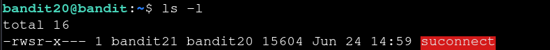
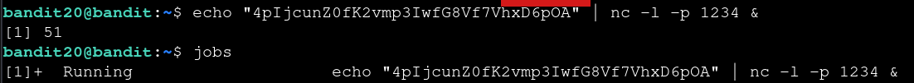
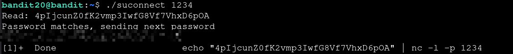

# Bandit — Level 20 → 21

**Category:** OverTheWire / Bandit  
**Difficulty:** Medium  
**Date:** 2026-08-13

## Goal

`bandit20`'s home directory held a SUID binary, `suconnect`, owned by `bandit21`. It connects to a given local port, and if it receives `bandit20`'s own password, it sends back the password for `bandit21`.

    ssh bandit20@bandit.labs.overthewire.org -p 2220

## Solution

Confirmed `suconnect` was SUID, owned by `bandit21`:

    $ ls -l
    -rwsr-x--- 1 bandit21 bandit20 15604 Jun 24 14:59 suconnect

`suconnect` needs something listening on a port to connect *to*, so first set up a listener with `nc` that serves `bandit20`'s password to whoever connects, and backgrounded it with `&`:

    $ echo "bandit20's password" | nc -l -p 1234 &
    $ jobs
    [1]+  Running    echo "..." | nc -l -p 1234 &

Then ran `suconnect` pointed at that same port. It connected to the listener, read the password, and since it matched, sent back the password for `bandit21`:

    $ ./suconnect 1234
    Read: bandit20's password
    Password matches, sending next password
    [REDACTED]

## Result

    Password for bandit21: [REDACTED]

## Key Takeaway

`suconnect` runs as `bandit21` (via SUID) but only replies once it has verified `bandit20`'s password over the network, so the trick isn't just running the binary — it's first standing up a listener on the port `suconnect` expects, using `nc -l` backgrounded with `&`, that hands over the current password to prove who's asking.
