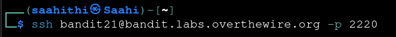
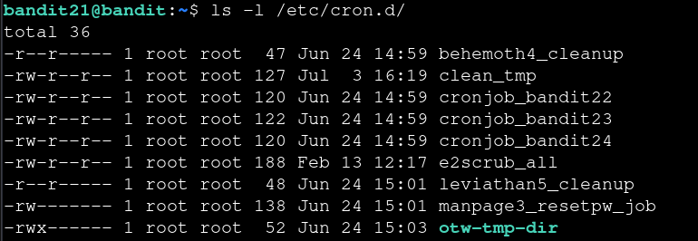
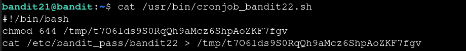

# Bandit — Level 21 → 22

**Category:** OverTheWire / Bandit  
**Difficulty:** Medium  
**Date:** 2026-08-13  
**Level page:** [bandit21.html](https://overthewire.org/wargames/bandit/bandit21.html)

## Goal

A cron job running as `bandit22` writes something useful to a file periodically. The password for `bandit22` had to be found by tracing that cron job.

    ssh bandit21@bandit.labs.overthewire.org -p 2220

## Solution

Listed `/etc/cron.d/` and found a job file named after this level:

    $ ls -l /etc/cron.d/
    -rw-r--r-- 1 root root 120 Jun 24 14:59 cronjob_bandit22

Read the cron entry to see what it runs and as which user:

    $ cat /etc/cron.d/cronjob_bandit22
    @reboot bandit22 /usr/bin/cronjob_bandit22.sh &> /dev/null
    * * * * * bandit22 /usr/bin/cronjob_bandit22.sh &> /dev/null

It runs `/usr/bin/cronjob_bandit22.sh` as `bandit22` every minute, so read that script next:

    $ cat /usr/bin/cronjob_bandit22.sh
    #!/bin/bash
    chmod 644 /tmp/t7O6lds9S0RqQh9aMcz6ShpAoZKF7fgv
    cat /etc/bandit_pass/bandit22 > /tmp/t7O6lds9S0RqQh9aMcz6ShpAoZKF7fgv

The script writes `bandit22`'s password into a fixed path in `/tmp` and makes it world-readable. Just had to read it:

    $ cat /tmp/t7O6lds9S0RqQh9aMcz6ShpAoZKF7fgv
    [REDACTED]

## Result

    Password for bandit22: [REDACTED]

## Key Takeaway

Couldn't read `bandit22`'s password directly, so I traced the cron job instead — `/etc/cron.d/` showed what it runs, and the script it pointed to was writing the password to a world-readable file in `/tmp`.
