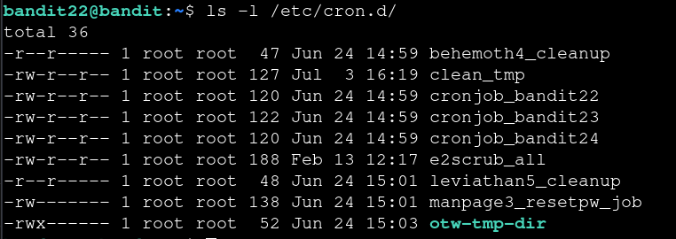
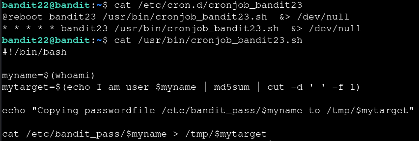
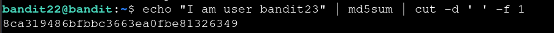

# Bandit — Level 22 → 23

**Category:** OverTheWire / Bandit  
**Difficulty:** Medium  
**Date:** 2026-08-13  
**Level page:** [bandit22.html](https://overthewire.org/wargames/bandit/bandit22.html)

## Goal

Similar setup to the last level: a cron job runs as `bandit23`, but this time the output filename isn't fixed — it's computed from an MD5 hash.

    ssh bandit22@bandit.labs.overthewire.org -p 2220

## Solution

Listed `/etc/cron.d/` (same directory as the last level) and found `cronjob_bandit23`:

    $ ls -l /etc/cron.d/
    -rw-r--r-- 1 root root 122 Jun 24 14:59 cronjob_bandit23

Read the cron entry and the script it runs:

    $ cat /etc/cron.d/cronjob_bandit23
    @reboot bandit23 /usr/bin/cronjob_bandit23.sh &> /dev/null
    * * * * * bandit23 /usr/bin/cronjob_bandit23.sh &> /dev/null
    $ cat /usr/bin/cronjob_bandit23.sh
    #!/bin/bash

    myname=$(whoami)
    mytarget=$(echo I am user $myname | md5sum | cut -d ' ' -f 1)

    echo "Copying passwordfile /etc/bandit_pass/$myname to /tmp/$mytarget"

    cat /etc/bandit_pass/$myname > /tmp/$mytarget

The output filename is deterministic: it's the MD5 hash of the string `I am user <username>`, where `<username>` is whichever user runs the script (`bandit23` when cron runs it). Reproduced that hash locally:

    $ echo "I am user bandit23" | md5sum | cut -d ' ' -f 1
    8ca319486bfbbc3663ea0fbe81326349

Read the resulting file:

    $ cat /tmp/8ca319486bfbbc3663ea0fbe81326349
    [REDACTED]

## Result

    Password for bandit23: [REDACTED]

## Key Takeaway

A "random-looking" filename derived from a hash isn't actually unpredictable if the hash's input is knowable — here the script hashed a fixed string plus `$myname`, so reproducing that same command locally with `bandit23` substituted in gave the exact filename the cron job would write to.
