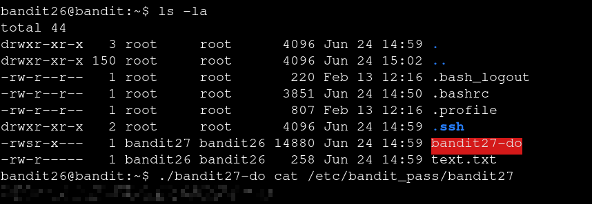

# Bandit — Level 26 → 27

**Category:** OverTheWire / Bandit  
**Difficulty:** Hard  
**Date:** 2026-08-14

## Goal

Continuing from the `bandit26` shell obtained by escaping the restricted login shell in the previous level, `bandit26`'s home directory held a SUID binary, `bandit27-do`, owned by `bandit27` — the same pattern as `bandit20-do` back in level 19.

## Solution

    $ ls -la
    -rwsr-x--- 1 bandit27 bandit26 14880 Jun 24 14:59 bandit27-do

Since it runs as `bandit27` regardless of caller, used it directly to read the password file:

    $ ./bandit27-do cat /etc/bandit_pass/bandit27
    [REDACTED]

## Result

    Password for bandit27: [REDACTED]

## Key Takeaway

Same technique as level 19→20: a SUID binary that runs an arbitrary command as its owner is a direct route to that owner's files. Recognizing the `rws` permission bit pattern is the trigger to try this immediately rather than looking for something more complex.
