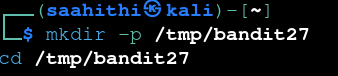
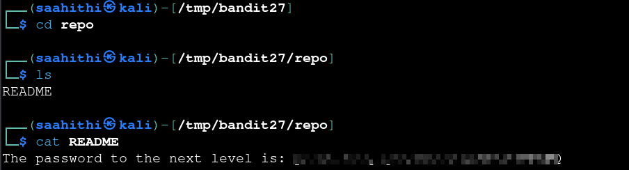

# Bandit — Level 27 → 28

**Category:** OverTheWire / Bandit  
**Difficulty:** Medium  
**Date:** 2026-08-14

## Goal

There's a git repository accessible over SSH as user `bandit27-git`, hosted at `/home/bandit27-git/repo`. The password for `bandit28` was somewhere in that repo.

## Solution

Set up a working directory on my own machine and cloned the repo directly over SSH:

    $ mkdir -p /tmp/bandit27
    $ cd /tmp/bandit27

    $ git clone ssh://bandit27-git@bandit.labs.overthewire.org:2220/home/bandit27-git/repo

The clone only needed `bandit27`'s password when prompted (not shown/typed in these screenshots). Once cloned, checked what was inside:

    $ cd repo
    $ ls
    README
    $ cat README
    The password to the next level is: [REDACTED]

## Result

    Password for bandit28: [REDACTED]

## Key Takeaway

`git clone` works directly over `ssh://` URLs, no different from cloning any other git remote — the level didn't require anything git-specific beyond that, since the password was sitting in plain sight in the repo's `README`.
