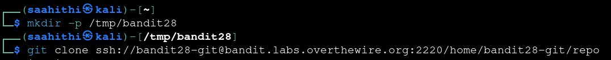
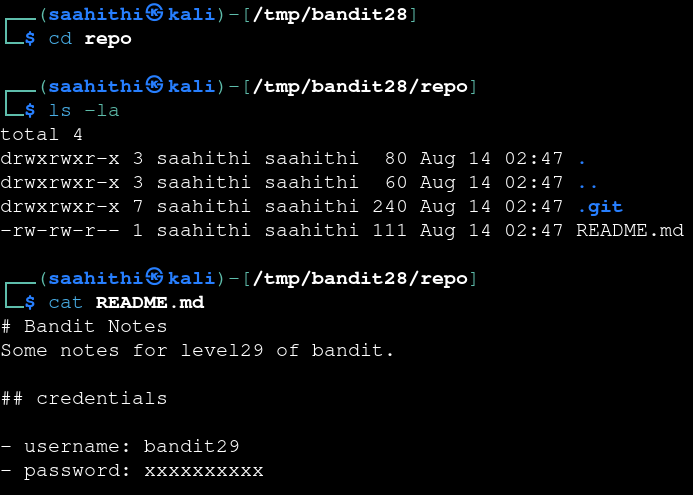
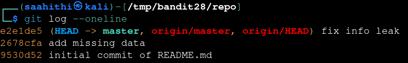
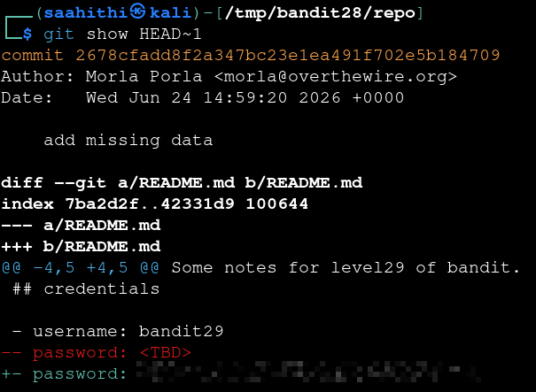

# Bandit — Level 28 → 29

**Category:** OverTheWire / Bandit  
**Difficulty:** Medium  
**Date:** 2026-08-14

## Goal

Another git repo, this time as `bandit28-git`. The current `README.md` doesn't contain a usable password — the goal was to find it in the repo's history instead.

## Solution

Cloned the repo the same way as the last level:

    $ mkdir -p /tmp/bandit28
    $ cd /tmp/bandit28
    $ git clone ssh://bandit28-git@bandit.labs.overthewire.org:2220/home/bandit28-git/repo

The current `README.md` had the password blanked out:

    $ cd repo
    $ ls -la
    .git  README.md
    $ cat README.md
    # Bandit Notes
    Some notes for level29 of bandit.

    ## credentials
    - username: bandit29
    - password: xxxxxxxxxx

Checked the commit history — the password was clearly redacted at some point, so an earlier commit might still have it:

    $ git log --oneline
    e2e1de5 (HEAD -> master, origin/master, origin/HEAD) fix info leak
    2678cfa add missing data
    9530d52 initial commit of README.md

The most recent commit's message ("fix info leak") was the giveaway — that's exactly the kind of commit that scrubs a password after accidentally including it. Diffed the commit just before it:

    $ git show HEAD~1
    diff --git a/README.md b/README.md
    ...
    - password: <TBD>
    + password: [REDACTED]

## Result

    Password for bandit29: [REDACTED]

## Key Takeaway

Removing a secret from the latest commit doesn't remove it from the repo's history — `git log` and `git show` on earlier commits can still surface it. A commit message like "fix info leak" is itself a strong hint to go check what the previous commit exposed.
