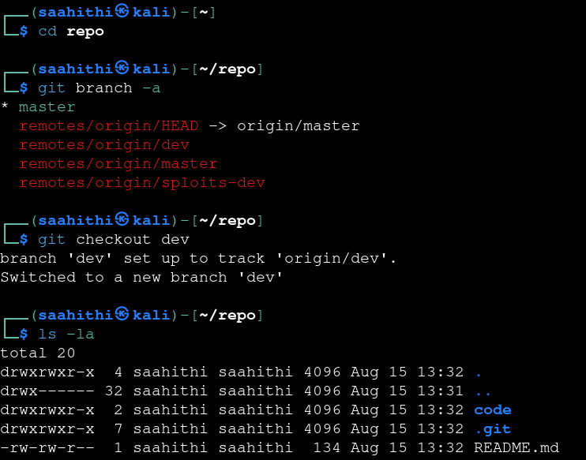
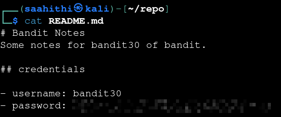

# Bandit — Level 29 → 30

**Category:** OverTheWire / Bandit  
**Difficulty:** Medium  
**Date:** 2026-08-15

## Goal

Same repo pattern as before, this time as `bandit29-git`. The default branch didn't have the password — it was hiding on a different branch.

## Solution

Cloned the repo:

    $ git clone ssh://bandit29-git@bandit.labs.overthewire.org:2220/home/bandit29-git/repo

Checked what branches existed beyond the default `master`:

    $ cd repo
    $ git branch -a
    * master
      remotes/origin/HEAD -> origin/master
      remotes/origin/dev
      remotes/origin/master
      remotes/origin/sploits-dev

Two extra branches were available remotely: `dev` and `sploits-dev`. Checked out `dev` first:

    $ git checkout dev
    branch 'dev' set up to track 'origin/dev'.
    Switched to a new branch 'dev'
    $ ls -la
    code  README.md

Read the README on this branch:

    $ cat README.md
    # Bandit Notes
    Some notes for bandit30 of bandit.

    ## credentials
    - username: bandit30
    - password: [REDACTED]

## Result

    Password for bandit30: [REDACTED]

## Key Takeaway

`git branch -a` lists remote branches that aren't checked out locally by default — a repo's `master`/default branch isn't necessarily where the interesting content lives, especially when branches like `dev` or `sploits-dev` hint at work-in-progress that wasn't meant to ship.
