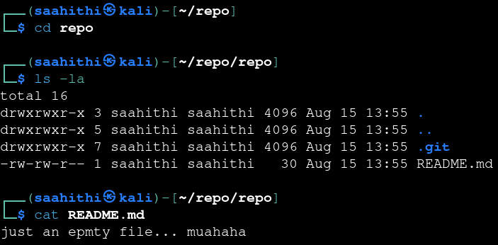
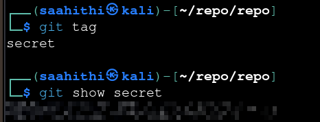

# Bandit — Level 30 → 31

**Category:** OverTheWire / Bandit  
**Difficulty:** Medium  
**Date:** 2026-08-15

## Goal

Same repo pattern again, as `bandit30-git`. This time the working tree itself was a dead end — the password had to be somewhere else in the repo's git objects.

## Solution

Cloned the repo:

    $ git clone ssh://bandit30-git@bandit.labs.overthewire.org:2220/home/bandit30-git/repo

Checked the working tree, which was a dead end on purpose:

    $ cd repo
    $ ls -la
    .git  README.md
    $ cat README.md
    just an epmty file... muahaha

Since the README was a decoy, checked for git tags — a common place to stash something outside the normal commit history:

    $ git tag
    secret
    $ git show secret
    [REDACTED]

## Result

    Password for bandit31: [REDACTED]

## Key Takeaway

A repo's password can live in places other than tracked files or commit messages — `git tag` lists annotated/lightweight tags, and `git show <tag>` reveals what's attached to one, which is exactly where I'd look next time the working tree and commit log both turn up nothing.
