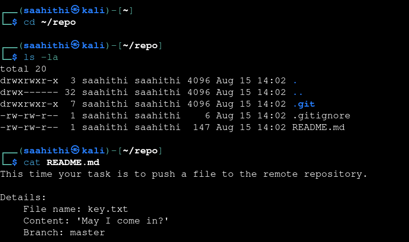
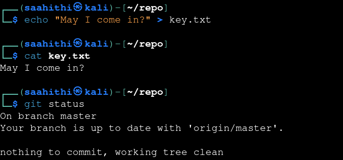
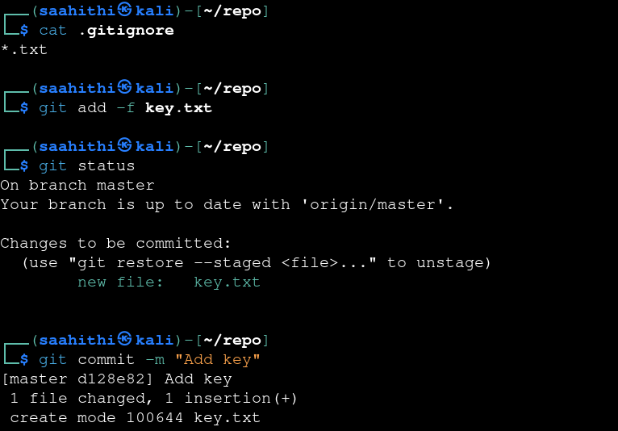
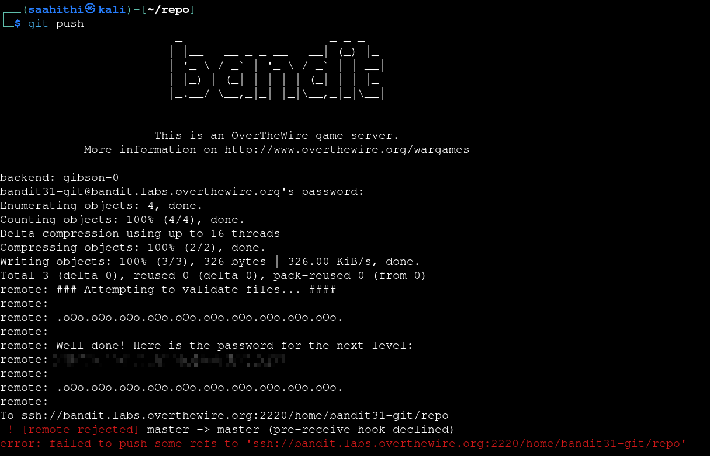

# Bandit — Level 31 → 32

**Category:** OverTheWire / Bandit  
**Difficulty:** Medium  
**Date:** 2026-08-15  
**Level page:** [bandit31.html](https://overthewire.org/wargames/bandit/bandit31.html)

## Goal

A different task this time: instead of finding something in the repo, `README.md` asked to push a specific file to the remote.

    $ git clone ssh://bandit31-git@bandit.labs.overthewire.org:2220/home/bandit31-git/repo

    $ cd repo
    $ ls -la
    .git  .gitignore  README.md
    $ cat README.md
    This time your task is to push a file to the remote repository.

    Details:
        File name: key.txt
        Content: 'May I come in?'
        Branch: master

## Solution

Created the file with the exact required content:

    $ echo "May I come in?" > key.txt
    $ cat key.txt
    May I come in?
    $ git status
    nothing to commit, working tree clean

`git status` showed nothing to commit even with the new file sitting right there — a sign it was being ignored:

    $ cat .gitignore
    *.txt

`.gitignore` excluded every `.txt` file, including the one the task required. `git add -f` overrides `.gitignore` for a specific file:

    $ git add -f key.txt
    $ git status
    Changes to be committed:
        new file:   key.txt
    $ git commit -m "Add key"
    [master d128e82] Add key
    1 file changed, 1 insertion(+)
    create mode 100644 key.txt

Pushed the commit:

    $ git push
    remote: Well done! Here is the password for the next level:
    remote: [REDACTED]
    ! [remote rejected] master -> master (pre-receive hook declined)
    error: failed to push some refs

## Result

    Password for bandit32: [REDACTED]

## Key Takeaway

`.gitignore` silently excludes matching files from `git add`/`git status`, even ones you explicitly created for a reason — `git add -f` forces past that. The password appeared in the server's response before the push was ultimately rejected by a `pre-receive` hook, so the actual push doesn't need to succeed for the goal to be met.
