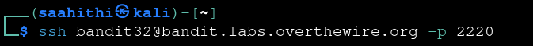
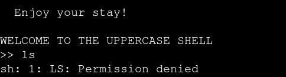
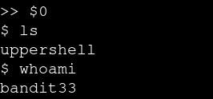
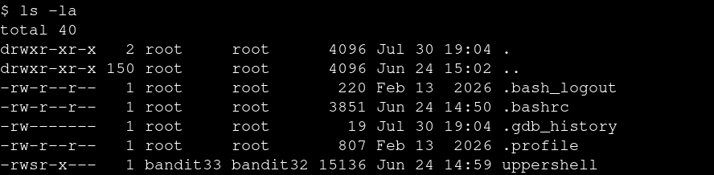
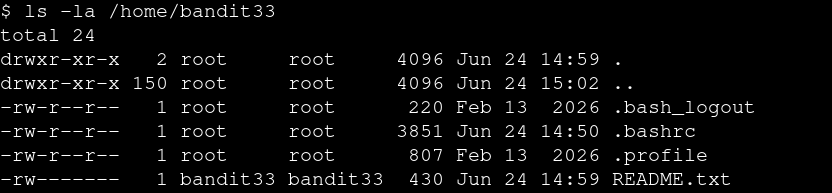
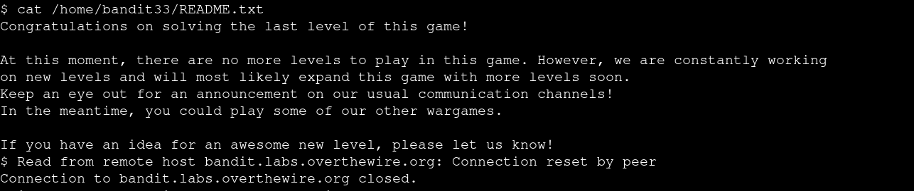

# Bandit — Level 32 → 33

**Category:** OverTheWire / Bandit  
**Difficulty:** Hard  
**Date:** 2026-08-15

## Goal

`bandit32`'s login shell is a restricted "UPPERSHELL" that uppercases every command before running it, so lowercase commands like `ls` fail outright.

    ssh bandit32@bandit.labs.overthewire.org -p 2220

## Solution

Confirmed the restriction: any input gets uppercased and passed to the shell, so `ls` becomes `LS`, which doesn't exist as a command:

    WELCOME TO THE UPPERCASE SHELL
    >> ls
    sh: 1: LS: Permission denied

Since only letters get transformed, a special variable like `$0` passes through untouched (no letters to uppercase). `$0` expands to the name of the currently running shell — evaluating it re-executes that shell, dropping into a normal, un-uppercased interactive session:

    >> $0
    $ ls
    uppershell
    $ whoami
    bandit33

`whoami` returned `bandit33`, not `bandit32` — the `uppershell` binary is SUID, owned by `bandit33`:

    $ ls -la
    -rwsr-x--- 1 bandit33 bandit32 15136 Jun 24 14:59 uppershell

With an effective shell as `bandit33`, checked that user's home directory:

    $ ls -la /home/bandit33
    -rw------- 1 bandit33 bandit33 430 Jun 24 14:59 README.txt

    $ cat /home/bandit33/README.txt
    Congratulations on solving the last level of this game!

    At this moment, there are no more levels to play in this game. ...

## Result

No further password — `bandit33`'s `README.txt` confirms this is the last level of the Bandit wargame.

## Key Takeaway

A restrictive input filter that only transforms letters can be bypassed with input made entirely of non-letters, like a shell variable (`$0`). Escaping to a real shell here also meant inheriting the SUID privilege of the binary that spawned it — `whoami` returning `bandit33` instead of `bandit32` confirmed the escape carried the elevated permission with it.
