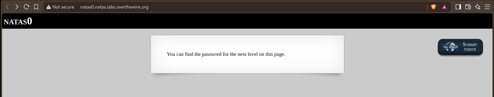
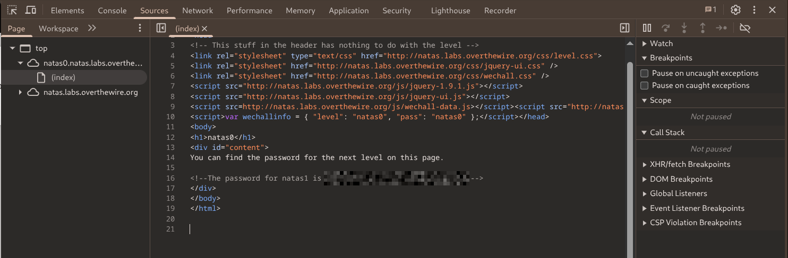

# Natas — Level 0 → 1

**Category:** OverTheWire / Natas  
**Difficulty:** Easy  
**Date:** 2026-08-15

## Goal

The password for `natas1` was somewhere on the `natas0` page.

    http://natas0.natas.labs.overthewire.org
    (username: natas0, password: natas0)

The rendered page just said "You can find the password for the next level on this page":

## Solution

The visible page content had nothing else on it, so the password had to be hidden in the HTML itself rather than displayed. Right-clicked and used "Inspect" to open DevTools and read the underlying markup:

    <!--The password for natas1 is [REDACTED] -->

## Result

    Password for natas1: [REDACTED]

## Key Takeaway

Natas levels can hide information in the page source that never renders visibly in the browser — checking "View Source" (or the dev tools Elements panel) is a first step whenever a level's visible content looks like a dead end.
