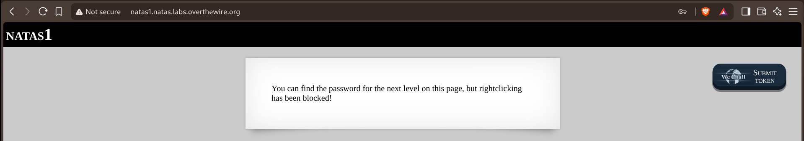
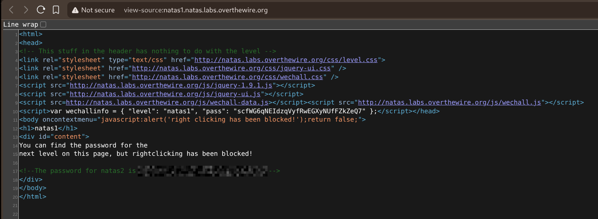

# Natas — Level 1 → 2

**Category:** OverTheWire / Natas  
**Difficulty:** Easy  
**Date:** 2026-08-15  
**Level page:** [natas1.html](https://overthewire.org/wargames/natas/natas1.html)

## Goal

Same idea as level 0 — the password for `natas2` was hidden in the page source — but this time right-clicking was blocked, so "Inspect" from the context menu wasn't an option.

The rendered page warned about this directly:

    You can find the password for the next level on this page, but rightclicking has been blocked!

## Solution

Right-click being disabled only blocks the context menu, not the browser's other ways of viewing source. Used the `Ctrl+U` keyboard shortcut instead, which opens `view-source:` directly:

    <body oncontextmenu="javascript:alert('right clicking has been blocked!');return false;">
    ...
    <!--The password for natas2 is [REDACTED] -->

The source also showed why right-click was blocked — just an `oncontextmenu` handler on `<body>`, plain JS, nothing actually stopping me from reading the page.

## Result

    Password for natas2: [REDACTED]

## Key Takeaway

Blocking the right-click context menu is a client-side JavaScript trick, not real protection — `Ctrl+U` (or typing `view-source:` directly into the address bar) bypasses it entirely since it doesn't go through the page's own event handlers.
