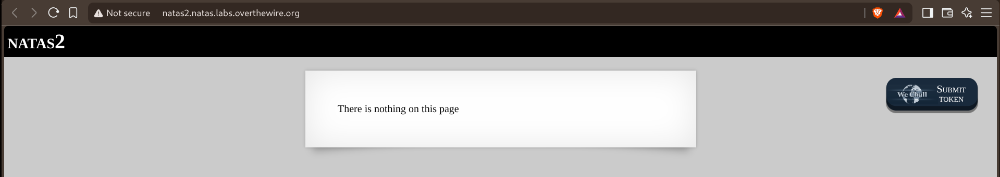
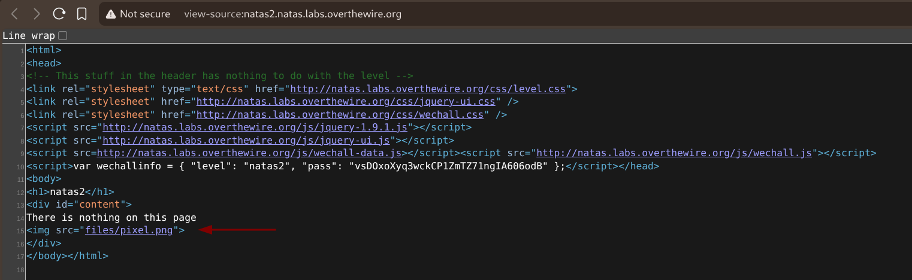
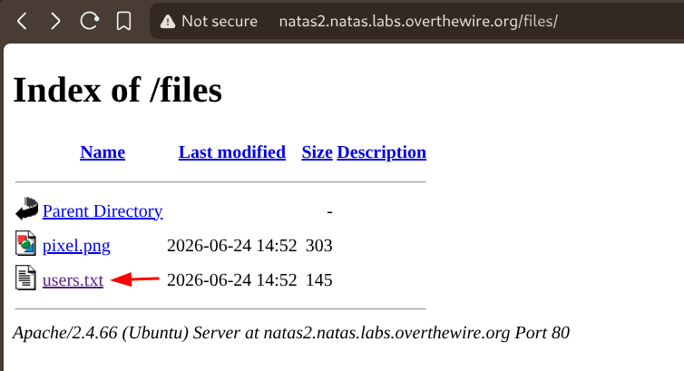
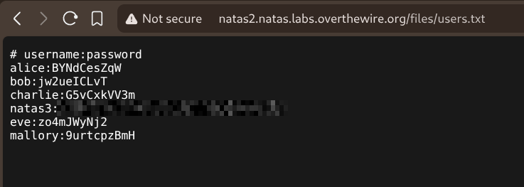

# Natas — Level 2 → 3

**Category:** OverTheWire / Natas  
**Difficulty:** Easy  
**Date:** 2026-08-15

## Goal

The rendered page claimed there was nothing here, no obvious comment this time.

    There is nothing on this page

## Solution

Checked the source anyway (`Ctrl+U`) rather than trusting the visible text. It referenced an image from a relative path:

    

That implied a `files/` directory existed on the server. Navigated to it directly, and directory listing was enabled — showing every file inside instead of just the one that was actually referenced:

    natas2.natas.labs.overthewire.org/files/
    pixel.png
    users.txt

`users.txt` wasn't linked or referenced anywhere in the page — it was only discoverable because the directory listing exposed it. Opened it directly:

    # username:password
    alice:BYNdCesZqW
    bob:jw2ueICLvT
    charlie:G5vCxkVV3m
    natas3:[REDACTED]
    eve:zo4mJWyNj2
    mallory:9urtcpzBmH

## Result

    Password for natas3: [REDACTED]

## Key Takeaway

An asset referenced by a relative path (`files/pixel.png`) can reveal a whole directory, not just that one file — if the web server has directory listing enabled, browsing to that directory directly shows everything in it, including files that were never linked from the page at all.
