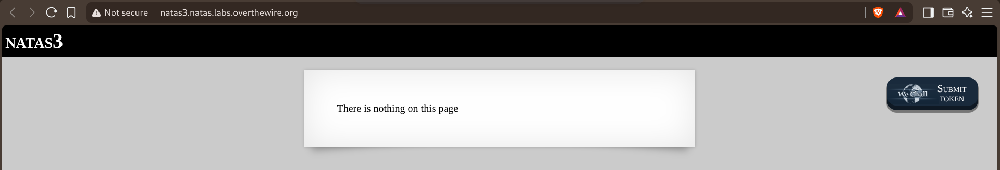
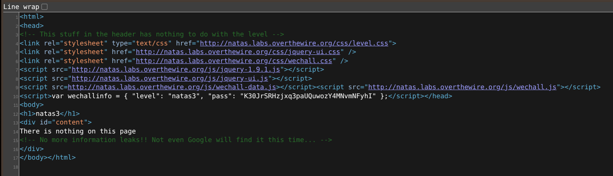
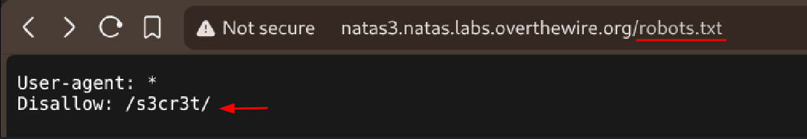
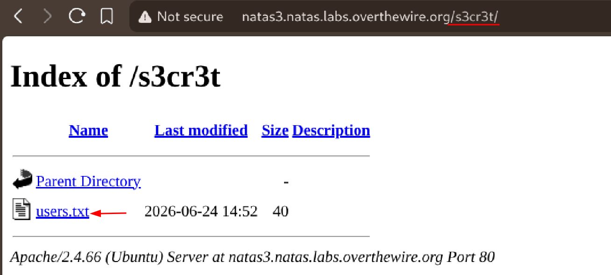
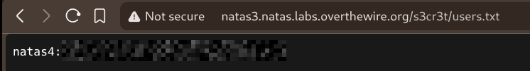

# Natas — Level 3 → 4

**Category:** OverTheWire / Natas  
**Difficulty:** Easy  
**Date:** 2026-08-16

## Goal

Same "nothing here" page again, but this time the source itself said not to bother with Google.

    There is nothing on this page

## Solution

Checked the source anyway:

    <!-- No more information leaks!! Not even Google will find it this time... -->

"Not even Google will find it" is a pretty direct hint about `robots.txt` — that's the file that tells search engine crawlers what not to index, so it's a natural place to hide a path you don't want discovered. Checked it:

    User-agent: *
    Disallow: /s3cr3t/

`Disallow` doesn't block me from visiting the path myself, it only asks well-behaved crawlers not to. Went straight to it, and directory listing was on again:

    natas3.natas.labs.overthewire.org/s3cr3t/
    users.txt

    natas4:[REDACTED]

## Result

    Password for natas4: [REDACTED]

## Key Takeaway

`robots.txt` is meant for search engines, not access control — a `Disallow` entry is basically a signpost pointing at something the site owner didn't want indexed, and nothing stops a human (or a script) from just visiting it directly.
