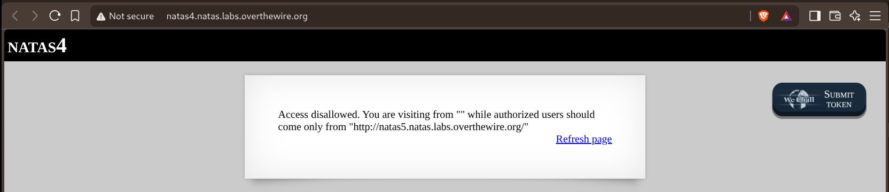
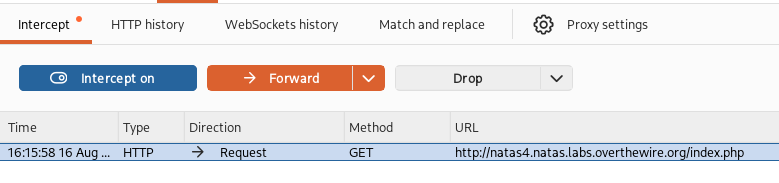
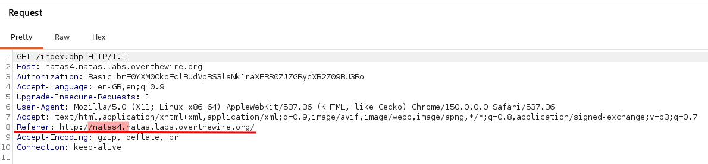
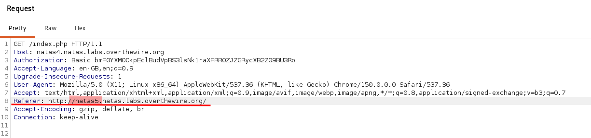
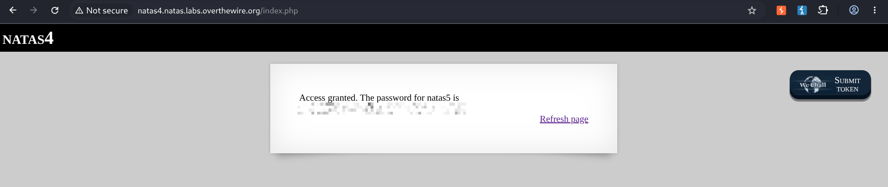

# Natas — Level 4 → 5

**Category:** OverTheWire / Natas  
**Difficulty:** Easy  
**Date:** 2026-08-16

## Goal

The page checked where the request claimed to come from and rejected it:

    Access disallowed. You are visiting from "" while authorized users should
    come only from "http://natas5.natas.labs.overthewire.org/"

## Solution

"Visiting from" is a description of the `Referer` HTTP header, not anything the browser normally exposes to me directly — so I needed to intercept and edit the actual request rather than change anything in the page itself. Set up Burp Suite to intercept the request to `natas4`:

    GET /index.php HTTP/1.1
    Host: natas4.natas.labs.overthewire.org

The intercepted request's `Referer` header was empty/self-referential — nothing pointing at `natas5`, which is why access was denied:

    Referer: http://natas4.natas.labs.overthewire.org/

Edited that header in Burp to claim the request came from `natas5` instead, then forwarded it:

    Referer: http://natas5.natas.labs.overthewire.org/

The server took the `Referer` header at face value and granted access:

    Access granted. The password for natas5 is [REDACTED]

## Result

    Password for natas5: [REDACTED]

## Key Takeaway

The `Referer` header is entirely client-supplied — a server trusting it for access control is trusting something the client controls completely. An intercepting proxy (Burp Suite) lets you edit any request header before it's sent, which is the direct way to satisfy checks like this rather than trying to trick the browser into sending it naturally.
