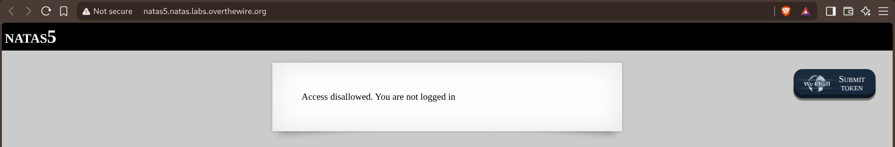
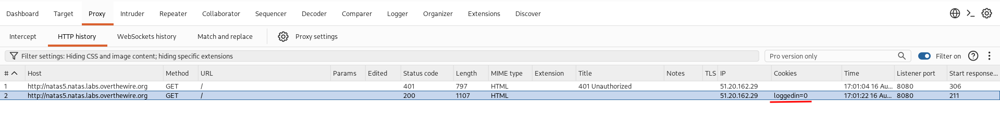
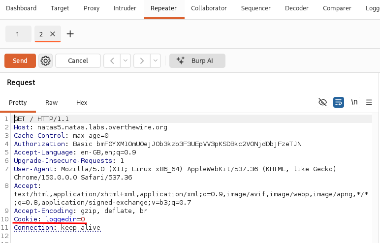
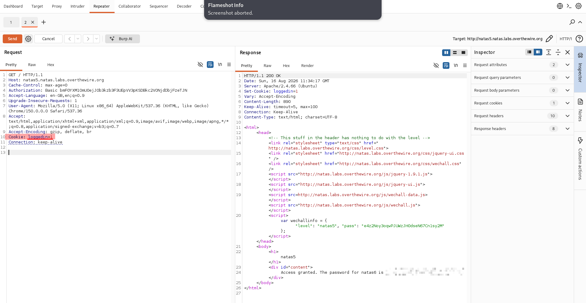

# Natas — Level 5 → 6

**Category:** OverTheWire / Natas  
**Difficulty:** Easy  
**Date:** 2026-08-16  
**Level page:** [natas5.html](https://overthewire.org/wargames/natas/natas5.html)

## Goal

    Access disallowed. You are not logged in

## Solution

Checked Burp's HTTP history to see what the browser was actually sending. Two requests stood out: an initial `401 Unauthorized`, then a follow-up `200 OK` carrying a cookie:

    GET / → 401 Unauthorized
    GET / → 200, Cookies: loggedin=0

So "logged in" status here isn't a session validated server-side against anything — it's just a cookie value the server trusts as-is, currently set to `0`. Sent the request to Repeater to look at (and edit) it directly:

    Cookie: loggedin=0

Changed the cookie to `loggedin=1` and sent it. The response set the cookie back to `1` and returned the password:

    Set-Cookie: loggedin=1
    ...
    Access granted. The password for natas6 is [REDACTED]

## Result

    Password for natas6: [REDACTED]

## Key Takeaway

A boolean cookie like `loggedin=0/1` is just client-supplied state the server is trusting blindly — same underlying problem as the `Referer` check in the last level, different header. Burp's Repeater makes editing a specific request and resending it faster than intercepting live traffic when you already know exactly which value to change.
