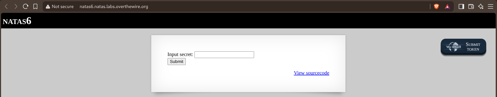
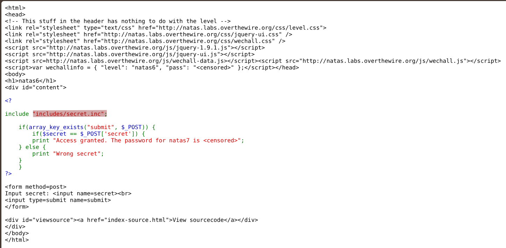
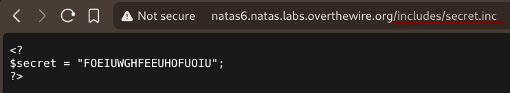
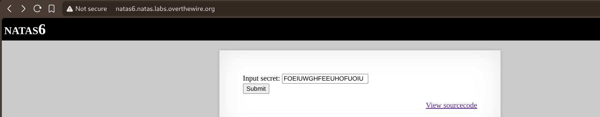
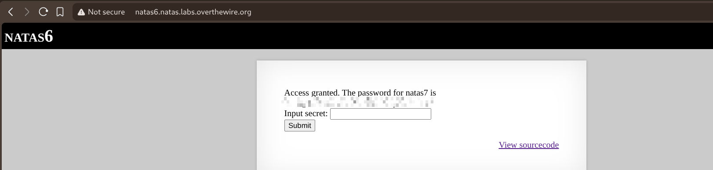

# Natas — Level 6 → 7

**Category:** OverTheWire / Natas  
**Difficulty:** Easy  
**Date:** 2026-08-16  
**Level page:** [natas6.html](https://overthewire.org/wargames/natas/natas6.html)

## Goal

A form asking for a secret, with a "View sourcecode" link right there on the page.

## Solution

Read the PHP source via the link instead of guessing:

    include "includes/secret.inc";

    if(array_key_exists("submit", $_POST)) {
        if($secret == $_POST['secret']) {
            print "Access granted. The password for natas7 is <censored>";
        } else {
            print "Wrong secret";
        }
    }

`$secret` gets its value from an included file, and that file lives at a normal, guessable path — `includes/secret.inc`. PHP includes aren't hidden from direct web access unless the server's specifically configured to block them, so I just requested it directly:

    natas6.natas.labs.overthewire.org/includes/secret.inc

    <?
    $secret = "FOEIUWGHFEEUHOFUOIU";
    ?>

Pasted that value into the form:

    Access granted. The password for natas7 is [REDACTED]

## Result

    Password for natas7: [REDACTED]

## Key Takeaway

A `.inc` (or any non-`.php`) include file is still just a static file the web server will happily serve if requested by name — the server doesn't know or care that the application only meant for it to be `include`d from PHP, not fetched directly.
