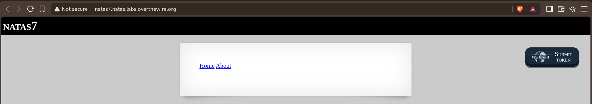
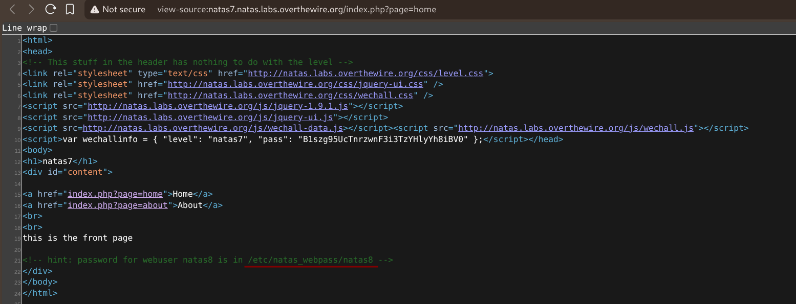
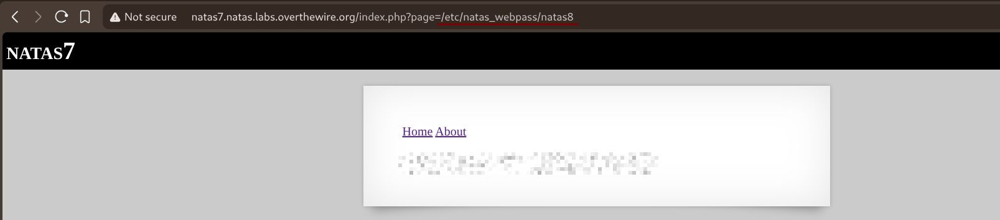

# Natas — Level 7 → 8

**Category:** OverTheWire / Natas  
**Difficulty:** Easy  
**Date:** 2026-08-16

## Goal

Just two links, "Home" and "About", loading content through a `?page=` parameter.

## Solution

Viewed the source of `index.php?page=home` and found both the mechanism and a hint sitting right in it:

    <a href="index.php?page=home">Home</a>
    <a href="index.php?page=about">About</a>
    ...
    this is the front page

    <!-- hint: password for webuser natas8 is in /etc/natas_webpass/natas8 -->

`page=home` and `page=about` strongly suggested the server was including a file named after whatever `page` was set to, with no restriction on what that value could be — a classic local file inclusion. Instead of `home` or `about`, passed the absolute path from the hint straight into the parameter:

    natas7.natas.labs.overthewire.org/index.php?page=/etc/natas_webpass/natas8

## Result

    Password for natas8: [REDACTED]

## Key Takeaway

A `?page=` parameter that switches between named views is often just building a file path from user input and including it directly — if there's no allowlist or path restriction, any file the web server process can read (like `/etc/natas_webpass/natas8`) can be pulled in the same way, not just the pages the app intended to expose.
