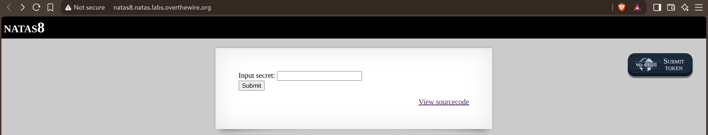
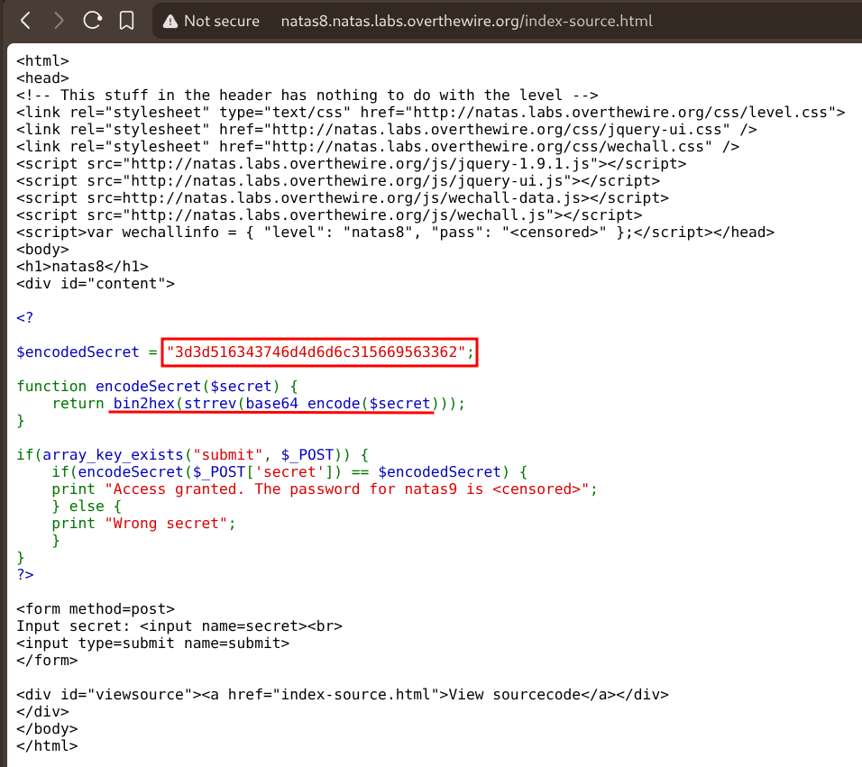
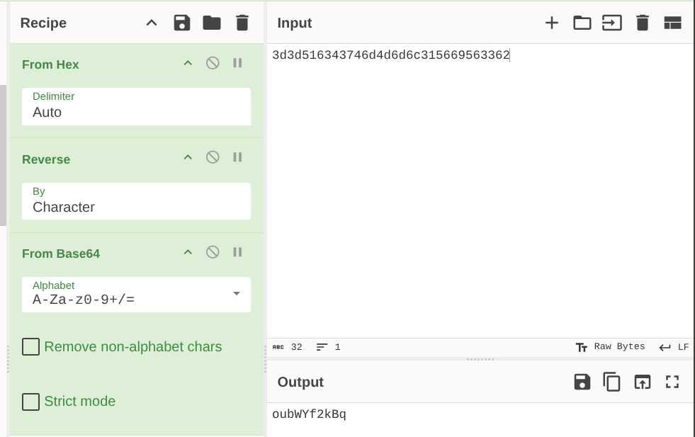
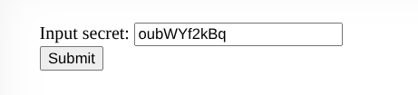
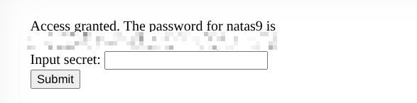

# Natas — Level 8 → 9

**Category:** OverTheWire / Natas  
**Difficulty:** Easy  
**Date:** 2026-08-16

## Goal

Same secret-input form pattern as level 6, but this time the comparison is against an encoded value instead of a plaintext one.

## Solution

Read the source via the "View sourcecode" link:

    $encodedSecret = "3d3d516343746d4d6d6c315669563362";

    function encodeSecret($secret) {
        return bin2hex(strrev(base64_encode($secret)));
    }

    if(array_key_exists("submit", $_POST)) {
        if(encodeSecret($_POST['secret']) == $encodedSecret) {
            print "Access granted. The password for natas9 is <censored>";
        } ...

To get a value that encodes to `$encodedSecret`, I needed to run `encodeSecret` backwards — undo each step in reverse order: hex → string, reverse the characters back, then base64-decode. Built that exact pipeline in CyberChef:

    From Hex → Reverse (by Character) → From Base64

    Input:  3d3d516343746d4d6d6c315669563362
    Output: oubWYf2kBq

Submitted the decoded value as the secret:

    Access granted. The password for natas9 is [REDACTED]

## Result

    Password for natas9: [REDACTED]

## Key Takeaway

Encoding isn't encryption — `encodeSecret()` only chains base64, a character reversal, and hex encoding, all fully reversible transformations with no key involved. Reading the function and undoing each step in the opposite order (in a tool like CyberChef) recovers the original input directly, no brute-forcing needed.
