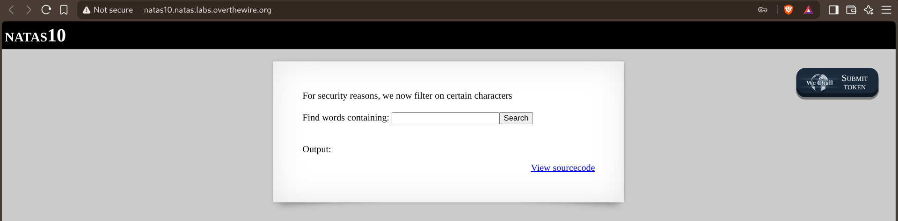
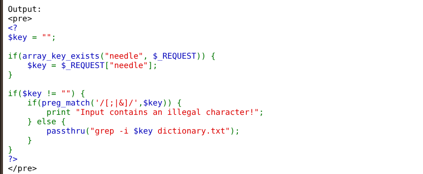
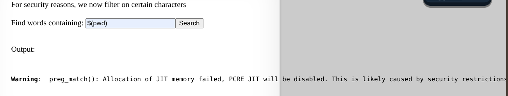
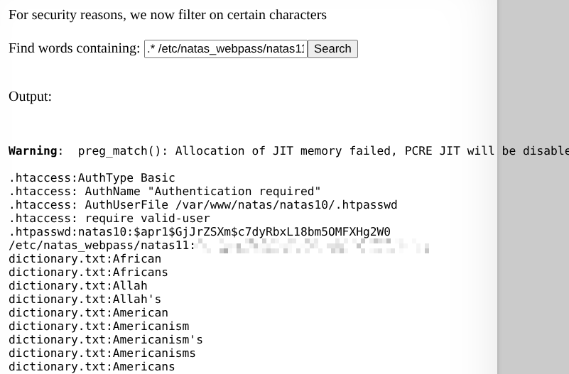

# Natas — Level 10 → 11

**Category:** OverTheWire / Natas  
**Difficulty:** Medium  
**Date:** 2026-08-17  
**Level page:** [natas10.html](https://overthewire.org/wargames/natas/natas10.html)

## Goal

Same search box as level 9, now with a filter:

    For security reasons, we now filter on certain characters

## Solution

The source showed exactly what got blocked:

    if(preg_match('/[;|&]/', $key)) {
        print "Input contains an illegal character!";
    } else {
        passthru("grep -i $key dictionary.txt");
    }

Only `;`, `|`, and `&` are blocked — command chaining is out, but nothing stops other characters. Tried `$(pwd)` to see if command substitution would slip past the filter; it wasn't flagged as illegal, though it didn't cleanly demonstrate command execution either:

Went with a different angle instead: `passthru()` runs the string through a real shell, and an unquoted argument starting with a literal `.` in a glob pattern *does* match dotfiles in bash (the usual "globs don't match hidden files" rule only applies when the pattern itself doesn't start with a dot). So typing `.*` as part of the search term gets shell-expanded into every dotfile in the current directory *before* grep ever sees it — turning one argument into several, including `.htaccess`, `.htpasswd`, and (once expanded) something that behaves as a match-everything pattern for grep itself. Combined with an explicit path to the target file:

    .* /etc/natas_webpass/natas11

    .htaccess:AuthType Basic
    .htaccess: AuthName "Authentication required"
    .htaccess: AuthUserFile /var/www/natas/natas10/.htpasswd
    .htaccess: require valid-user
    .htpasswd:natas10:$apr1$GjrZSXm$c7dyRbxL18bm5OMFXHg2W0
    /etc/natas_webpass/natas11:[REDACTED]
    dictionary.txt:African
    ...

grep prints filename prefixes whenever it's given more than one file to search, which is exactly why `.htaccess`, `.htpasswd`, the target password file, and `dictionary.txt` all showed up together — the shell had turned a single blocked-character-free string into several filename arguments.

## Result

    Password for natas11: [REDACTED]

## Key Takeaway

Blocking `;`, `|`, and `&` only stops command *chaining* — it does nothing about how the shell parses a single command's arguments. An unquoted glob like `.*` gets expanded by the shell itself before the target program (`grep`) ever runs, silently turning one user-controlled token into a list of filenames, which is enough to read arbitrary files without ever needing a blocked character.
